# GPU调用

## 概要

>对python文件支持GPU Debug、GPU Run、Run Task；对shell文件支持Run Shell、Run Task。
以上任务运行均与workshop状态无关，您可在任务运行时停止workshop。

除了Run Task为训练态，其他功能均为开发态，即会有Log输出，但是不会保存。

### 配置页参数介绍

**在代码区或对对应文件右击**，点击相应功能后弹出如下配置页面：
   

| 参数名称                  | 说明                                                                 | 备注                                                                 |
|---------------------------|----------------------------------------------------------------------|----------------------------------------------------------------------|
| Configurations        | 查看已保存的配置信息                                                 | 可快速载入历史配置                                                   |
| Environment          | GPU运行的基础镜像                                                   |强烈推荐与workshop的镜像保持一致 |
| Resource              | GPU调用时分配到的资源                                                 | - 可选择显卡数量、型号<br>- 卡型号后内容为系统自动适配的CPU、内存<br><span style="color: red">※ 40G卡型暂不支持使用多卡</span> |
| Save as configuration | 保存当前GPU调用配置                                                 | 勾选后可供下次直接调用                                               |
| ENV                   | 环境变量配置                                                       | 支持键值对形式注入                                                   |
| Args                  | 命令行参数                                                         | 按需传入执行参数                                                     |
| Python Module         | Python模块入口                                                     | 支持Python模块                                       |
| Work Dir              | 工作目录路径                                                       | 不同项目可配置不同路径                                               |

> "6C 80G"是指为每卡分配了6个CPU与80G内存，以此类推。**每并行度可用CPU数为10，内存为121G，超出后将报错超出quota**；

### 常用功能介绍

提交调用GPU（所有类型）成功后，对**Running状态**下的进程，可以通过右击 DEVELOP SESSION 中的对应session，进行下列操作：

   

| 操作       | 功能描述                     | 使用场景               |
|:----------:|:---------------------------:|:---------------------:|
| Terminal   | 打开运行终端，实时查看进程状态和GPU使用率 | 使用nvidia-smi或nvi-top实时监控GPU状态      |
| View Log   | 查看任务实时/历史运行日志      | 检查执行结果和错误     |
| Copy Path  | 复制log目录路径（Run Task功能专属） | 在终端快速访问日志目录 |
| Delete     | 手动终止进程并释放资源        | 停止异常任务          |

## GPU Debug

提供 Debug 调试功能，支持断点调试，并在调试控制台中查看输出信息。


## GPU Run

GPU Run提供与VSCode直接Run代码类似的开发态执行体验，运行Log默认会在输出中展示。运行结束后将会自动释放资源，停止计费。

## Run Shell

与GPU Run类似，Run Shell可用于运行sh脚本，也可用于编译环境，但如上文所说编译后的环境只会保存在临时存储中，关闭workshop后会清除。
>注：若使用了conda环境，则在sh文件中需要添加conda activate [你的环境名]命令，或在.bashrc文件中直接激活conda环境。

## Run Task

Run Task作为唯一训练态功能，可用于运行多worker分布式任务（torchrun）。此时GPU并行度=GPU数*worker数。

   

运行Task时默认不会有Log输出。如需查看日志，需在session中等待Task状态切换为Running后，右击“View log”查看；或右击“copy path”，复制日志文件目录到终端中，通过cd打开查看。

同时，Run Task支持在本地VSCode中查看或下载日志。

    
   

- 操作介绍

| 操作     | 功能描述                     |
|:--------:|:---------------------------:|
| View Log   | 查看Task的日志信息           |
| Log Download  | 下载Task的日志信息到本地           |
| Stop     | 停止当前正在运行的Task       |
| Monitor  | 资源监视器，可查看CPU、内存、GPU使用情况 |
| Delete   | 删除Task的日志信息           |

>本地VSCode中，Delete功能会停止Task并删除日志信息。

## 命令行执行GPU调用

❗ **重要** ❗：

1️⃣ 使用命令行连接workshop前，需要至少**打开**一次对应的workshop。

2️⃣ 使用期间需要保持**本地**VSCode处于打开状态，不能关闭。

3️⃣ 暂时无法使用命令行查看日志，预计在下版本中增加。

1. Open需要通过命令行连接的workshop，然后在本地VSCode终端中使用ssh连接，注意远程服务器地址是 [即将连接的workshop名称]+.bj1：

    

2. 在终端中输入aladdin -h，查看可用命令及其相关用法：

   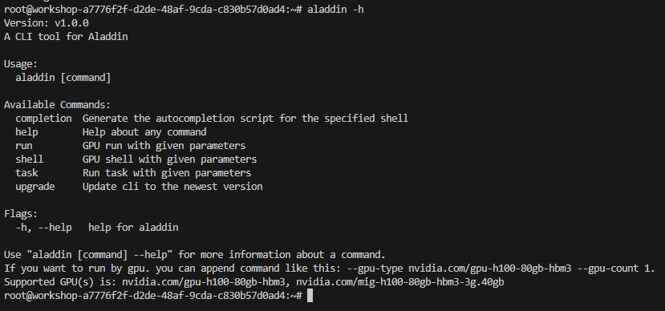 

3. 同样地，也可以用相同方法查看以上各命令的使用方法和相关参数：
   >注：若仅使用CPU运行任务，需要对 --cpu int 和 --mem int 两个参数进行赋值修改。若使用GPU运行任务，则这两个参数是固定值，无法修改。

    

4. 以快速开始中的Demo为例，使用80G GPU卡的运行命令为：

   ```bash
   aladdin run -f gputest.py --gpu-type nvidia.com/gpu-h100-80gb-hbm3 --gpu-count 1 --image registry.hd-01.alayanew.com:8443/aladdin/torch:2.6.0-cu124
   ```

   输出示例如下，其中可以看到启动GPU任务时的参数信息，并且自动修正了CPU和内存的大小：
   ```bash
   2025/06/20 09:57:12 [WARNING] Fix Cpu to 13, Mem to 200, because gpu-type is nvidia.com/gpu-h100-80gb-hbm3, gpu-count is 1
   2025/06/20 09:57:12 
   File            : gputest.py
   Image           : registry.hd-01.alayanew.com:8443/aladdin/torch:2.6.0-cu124
   Resource        : Cpu: 13(H), Mem: 200(GB), Gpu: nvidia.com/gpu-h100-80gb-hbm3(1)
   PythonEnv       : /usr/bin/python
   DeleteSession   : false
   SaveAsConfig    :
   Env             :
   Args            :
   WorkDir         : /root
   Ports           : []

   2025/06/20 09:45:24 start success. name: run-6056d7a71bd549a0b2, id: d828bfc2-1b57-4d28-b64f-f0bbb0be0df6
   ```

5. 日志查看命令正在开发中，目前仅可通过Session的View Log功能查看：

    

## 端口转发

❗ **重要** ❗：


1️⃣ 如果远端服务使用结束，一定要记得**手动delete** shell任务，否则会一直占用GPU资源，产生不必要的费用。

2️⃣ 所有server**必须绑定0.0.0.0**，不能使用127.0.0.1或localhost。

3️⃣ 暂不支持TCP协议，仅支持HTTP协议。

### 使用端口转发启动Jupyter

1. 使用**torch镜像**启动workshop，进入远端页面后，选择/root目录作为工作路径。

   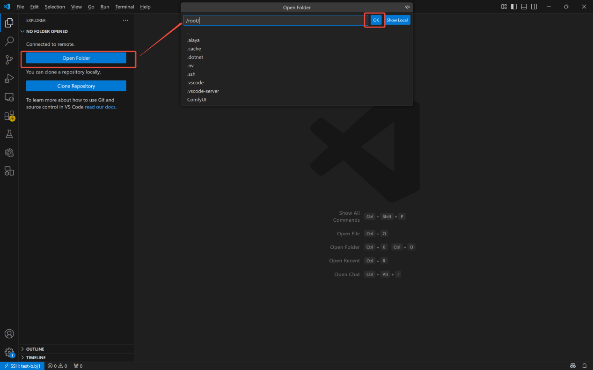 

2. 打开远端页面终端，输入以下命令安装Jupyter，并保存为新镜像：
``` bash
# 用 Anaconda 安装
conda install jupyter notebook
# 用 pip 安装
pip install jupyter notebook
```

- 通过以下代码验证Jupyter是否安装成功：
``` bash
jupyter --version
```

  - 输出示例如下：

``` text
Selected Jupyter core packages...
IPython          : 8.36.0
ipykernel        : 6.29.5
ipywidgets       : 8.1.7
jupyter_client   : 8.6.3
jupyter_core     : 5.7.2
jupyter_server   : 2.16.0
jupyterlab       : 4.4.2
nbclient         : 0.10.2
nbconvert        : 7.16.6
nbformat         : 5.10.4
notebook         : 7.4.2
qtconsole        : not installed
traitlets        : 5.14.3
```
- 在本地窗口保存镜像[保存镜像](#保存workshop环境)，这里保存为了jupyter

   

3. 在/root目录下新建.sh文件，输入以下命令：

``` bash
jupyter notebook --allow-root --ip=0.0.0.0 --port=8888 --no-browser
```
4. 在代码区或对.sh文件右击，选择Run Shell运行，选择**已保存的镜像**，并通过任一方法添加端口：
 - **方法1**：通过Run Shell配置页<sup>1</sup>添加端口
 展开“Advanced”后，点击“+Add External Access”<sup>2</sup>新建端口，输入端口号<sup>3</sup>（Jupyter Sever启动端口号默认为“8888”），提交运行

    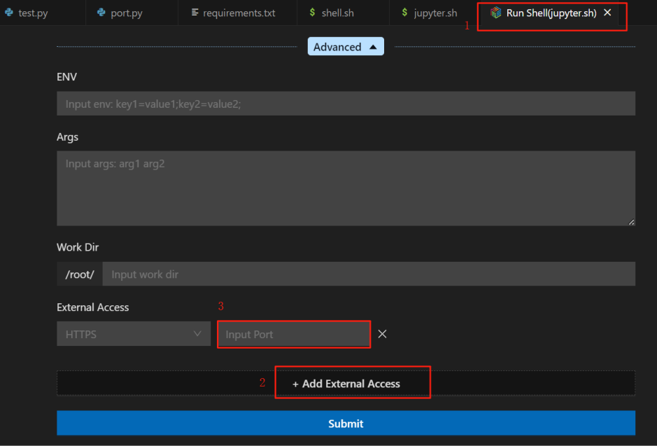 

 - **方法二**：Run Shell启动后，右击**Running**的session，选择“Add External Access”，在弹出窗口中输入端口号

    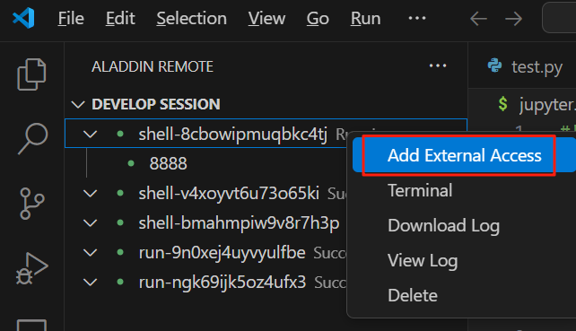

>注意：.sh文件只有处于Running中才能新建端口，success或failed状态下，都不可新建端口。

### 访问端口
1. Run Shell输出中打印了sever url后，点击session下的端口名称右侧的箭头，此时浏览器中弹出Jupyter网页：

   
   

2. 在输出中找到token，在Juypter网页中填写，登录Jupyter服务器：

   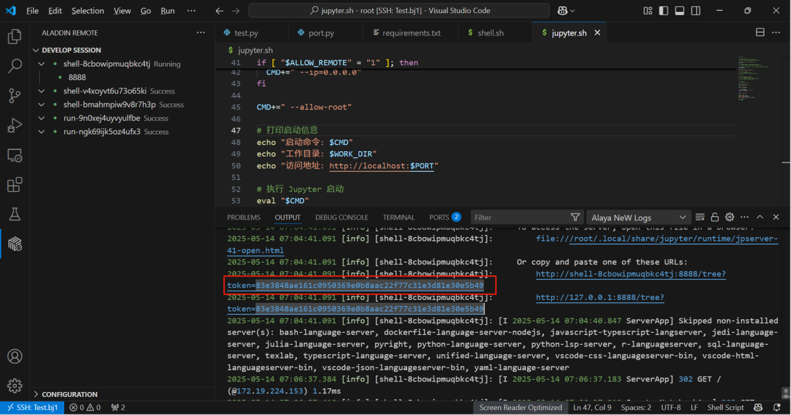
3. 启动Jupyter服务器后，可借助Jupyter实现如下功能：

- **功能1**：在浏览器中使用Jupyter
  通过Jupyter网页，可以看到/root目录下的所有文件，并在Jupyter中编译代码

     

- **功能2**：在VSCode中使用Jupyter（**需提前安装Jupyter和Python插件**）
  （1）在workshop中新建.ipynb文件（Jupyter文件）

    

    （2）选择Select Kernel -> Existing Jupyter Server

    
    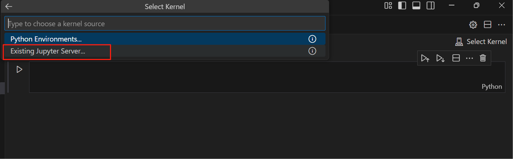

    输入Jupyter浏览器地址，回车

    
    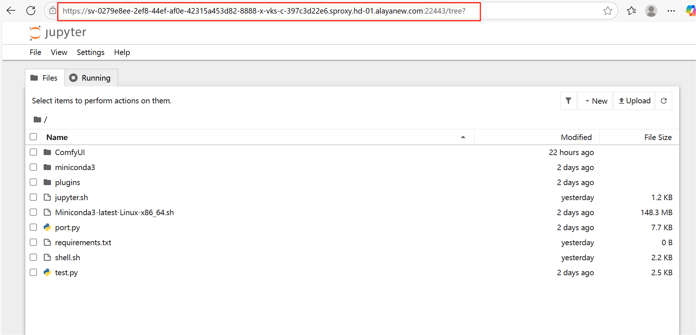

    输入token，回车

    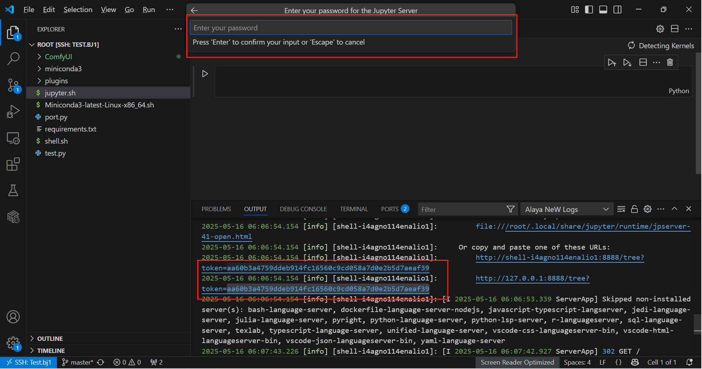

    继续回车

    

    选择Python 3

    

    文件右上角变成了Python 3(ipykernel)，说明设置成功，此时就可在VSCode中利用Jupyter的功能调试代码了。

    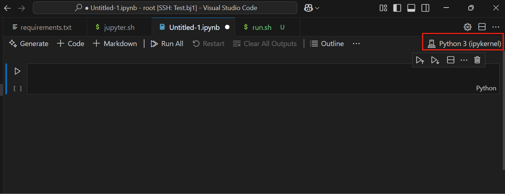

    （3）验证是否可用：在Jupyter网页中新建任意文件，然后在VSCode输入以下代码，运行测试。
    ``` bash
    import torch
    torch.cuda.is_available()
    ```
    输出如下：
    ``` text
    True
    ```
    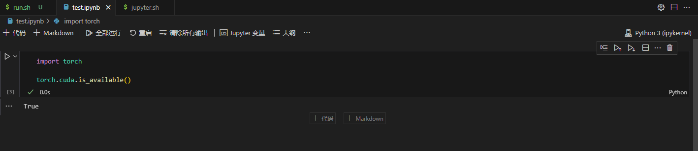

### 下载使用ComfyUI
1. 在远端页面终端中执行以下命令，clone代码：
``` bash
git clone https://gh-proxy.com/github.com/comfyanonymous/ComfyUI.git
```
   

2. 下载完成后，在ComfyUI文件夹下新建run.sh文件，将以下代码复制到run.sh文件中：
``` bash
apt update && apt install -y cmake g++ make
pip install torch torchvision torchaudio --extra-index-url https://download.pytorch.org/whl/cu128
pip install -r requirements.txt -i https://mirrors.tuna.tsinghua.edu.cn/pypi/web/simple
python main.py --listen 0.0.0.0 --port 8188
```
3. 在代码区或对文件右击，选择Run Shell运行，填写配置时需注意：
- 若打开文件目录为/root，则需在高级配置的“Work Dir”中填写文件路径，即“ComfyUI” 
- 添加外部访问端口，此处须与port参数保持一致，即填写“8188”

   

4. 点击Submit后提交任务，等待安装并运行

5. 安装完成后，点击session下的端口名称右侧的箭头，即可打开网页，通过浏览器访问服务。

   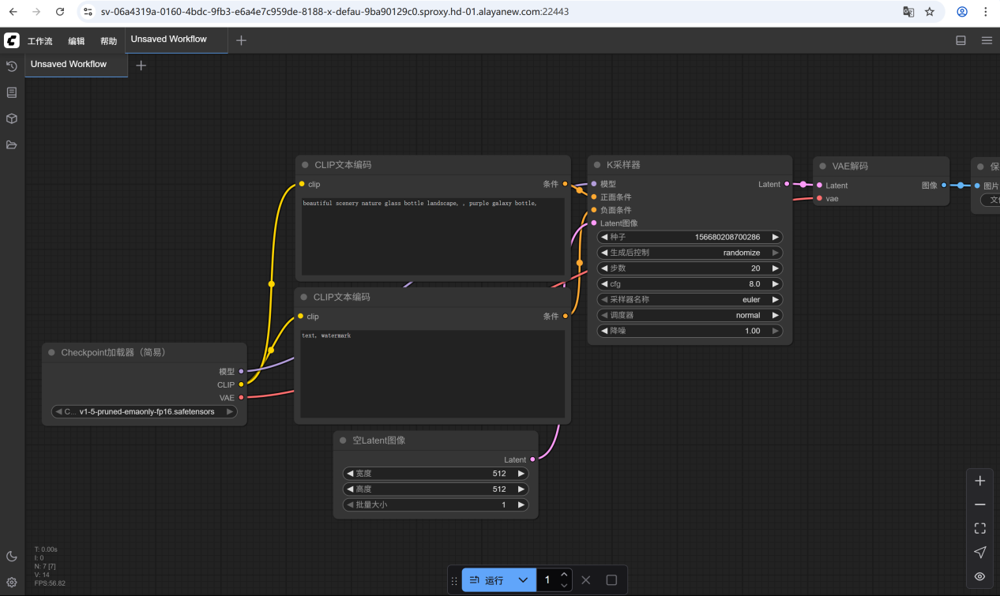
