# AladdinEdu使用手册

## 简介

> 严肃声明：严禁挖矿，一经发现一律清空所有算力并永久封号！

🔹欢迎关注公众号“九章云极AladdinEdu”，获取更多活动与福利！

🔹AladdinEdu，同学们用得起的算力平台。

🔹必看文档：

    1. [快速开始](#快速开始)

    2. [数据](#数据)
  
    3. [充值与计费](#充值与计费)

## 学术资源加速

### 公开资源

Github加速：https://gh-proxy.com/ 

Huggingface加速：https://hf-mirror.com

## 快速开始

>AladdinEdu的使用主要分为三步，workshop建立 > 环境配置 > GPU调用，以下内容将围绕此流程展开。

使用流程图

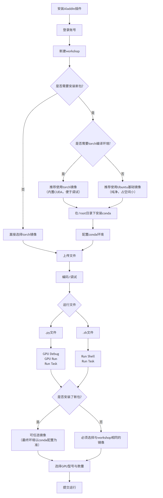

架构图

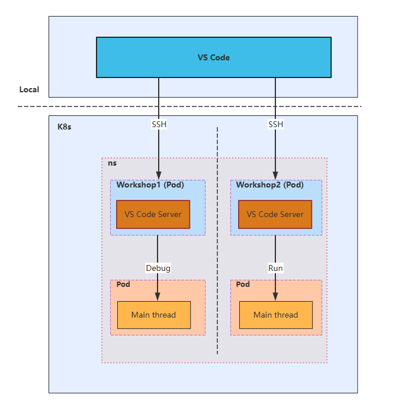

### 插件初始化

_本节预计完成时间：2min_

#### 插件安装
以VSCode版本为例

在扩展中搜索Aladdin，点击安装：

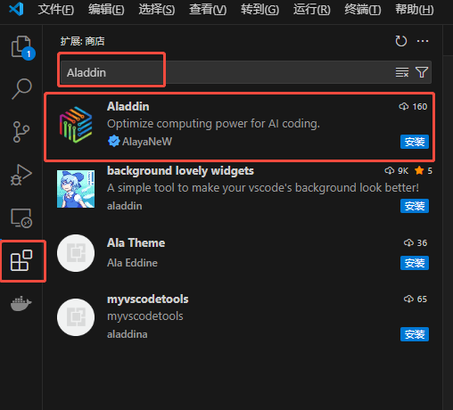

安装完成后可在活动栏看到Aladdin插件图标，安装成功：


#### 账号登录

以VSCode版本为例，点击Aladdin插件图标，选择Login Personal Account，弹窗后选择“打开”外部网站（AladdinEdu平台）：

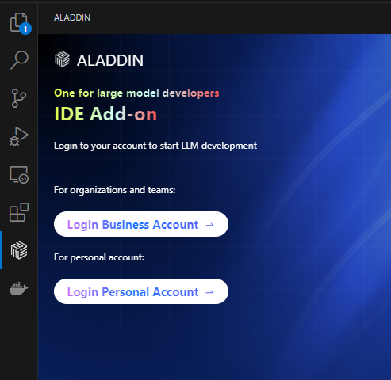

在AladdinEdu平台中使用手机号或账号密码登录，首次使用者请先注册：

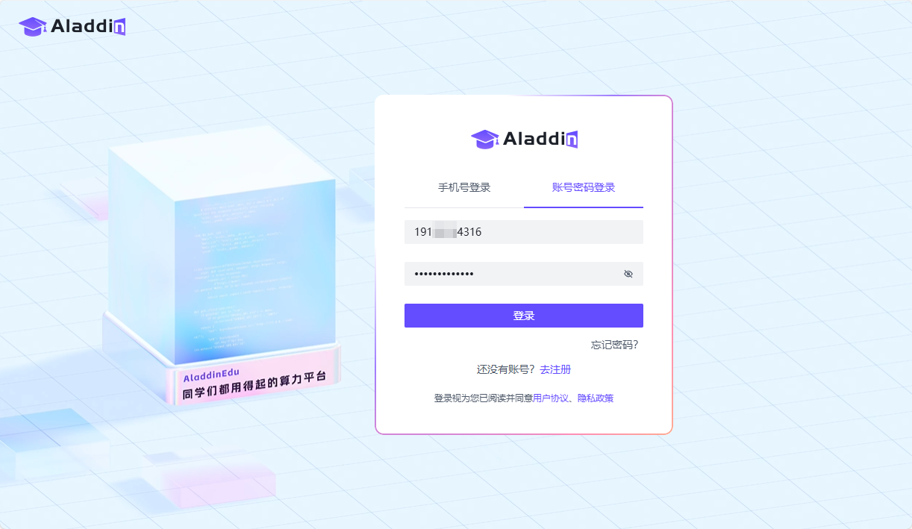

登录成功后点击“点击返回VSCode”，然后**手动**返回VSCode，弹窗后选择“打开”此URL，此时VSCode中提示登录成功：

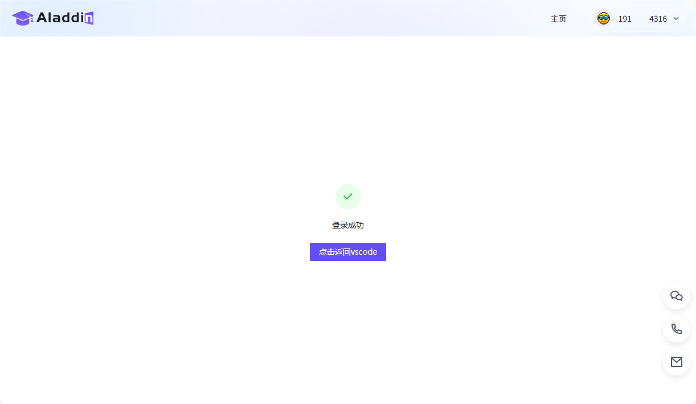

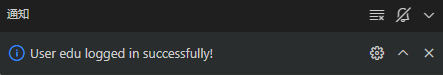

### workshop创建

_本节预计完成时间：3.5min_

>Stop时workshop中的数据（包括环境）将**全部保存**，因此重新Open后无需再次配置和上传数据。总之，workshop在，数据在。但是，自当前算力套餐失效起，若15日内未登录过AladdinEdu平台，存储将会被释放。

workshop为Aladdin插件的编码区，可在本地VSCode中连接远程服务器。

在workshop菜单栏中点击 **+**，新建workshop：

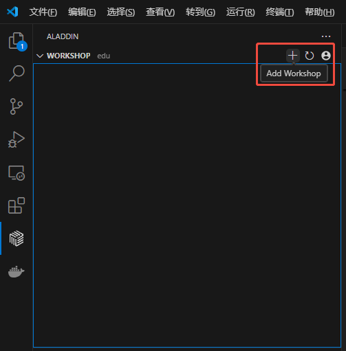

填写workshop名称，选择基础镜像与资源（推荐选择“CPU:4 MEM:16G”）：

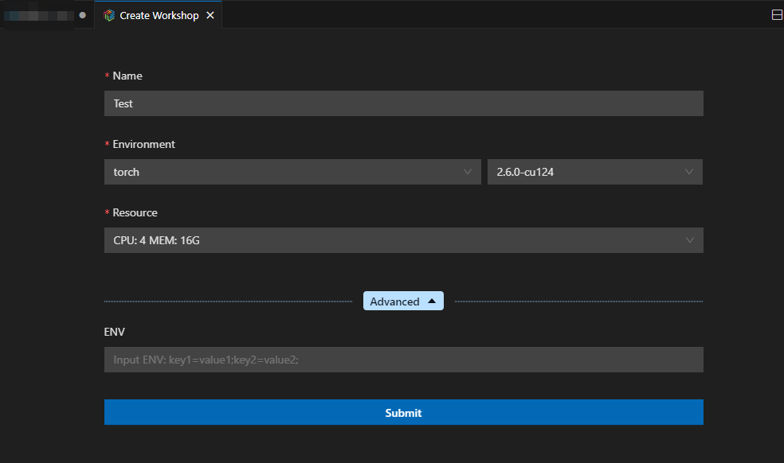

- workshop启动参数介绍

| 参数名称       | 说明                                                                 | 备注                                                                 |
|----------------|----------------------------------------------------------------------|----------------------------------------------------------------------|
| **Environment** | 当前workshop使用的容器镜像                                         | 通常包含预装软件和基础运行环境                                       |
| **Resource**    | 当前workshop启动时分配到的CPU和内存资源                                    | 这些资源与GPU运行时是共享的，<br>GPU资源详情请查看[GPU调用](#gpu调用) |
| **ENV**        | 当前workshop运行时的环境变量                                         | 可用于配置应用参数、API密钥等敏感信息                                |


>注：目前不支持保存私有镜像。如需安装任何**自定义包**，此处镜像可**随意选择**。
**重要 ❗ ：如需打开远端页面的Cursor，需在ENV下配置科学上网信息。**


- 镜像介绍

| 镜像类型 | 版本标签    | 包含内容                                                                 |
|:--------:|:-----------:|:------------------------------------------------------------------------|
| torch    | 2.5.1-cu124 | **核心包:**<br>`torch==2.5.1` `torchvision==0.20.1` `torchaudio==2.5.1` `cuda==12.4`<br>**附加包:**<br>`datasets` `transformers` `scikit-learn` `peft` `tiktoken` `blobfile` `sentencepiece` `protobuf` `deepspeed` |
| torch    | 2.6.0-cu124 | **核心包:**<br>`torch==2.6.0` `torchvision==0.21.0` `torchaudio==2.6.0` `cuda==12.4`<br>**附加包:**<br>同 2.5.1 版本 |
| python | 3.10/3.11/3.12/3.13 | 纯净Python环境 |
| ubuntu   | 22.04       | 纯净 Ubuntu 22.04 系统                                                  |

点击提交后会出现插件的状态提示，配置预计在2min左右完成，提示由“Workshop is waiting for creating.”变为“Workshop is created.”：

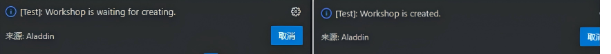

此时会弹出一个新窗口（后文统称**远端页面**），选择"Linux"，之后远端页面中将自动安装相关插件：

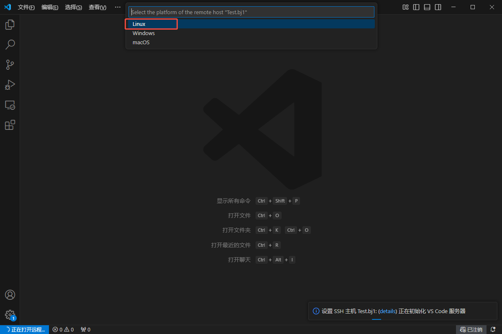

等待远端页面中出现Aladdin插件图标，workshop创建完成：

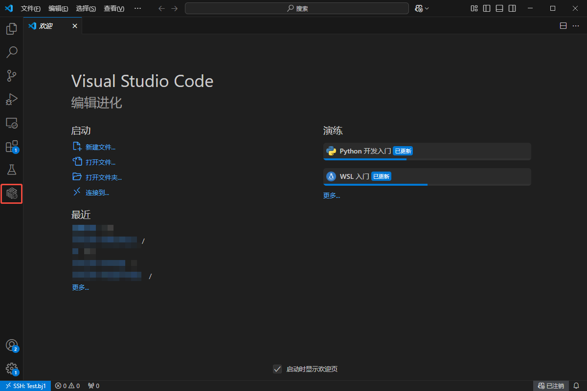
***
#### 常见问题
Q：启动workshop时Environment栏无内容，如何处理？

A：网络延迟或设备卡顿引起，稍等片刻即可。

Q：启动workshop后提示填写locahost密码，如何处理？

A：这种情况下是由于您当前设备中可访问 ~/.ssh 或 ~/.alaya/ssh 的用户过多，删除至仅当前登录用户可访问即可恢复正常，点击查看[解决方案链接](https://blog.csdn.net/chaoenhu/article/details/103698804)。

Q：workshop打开远端页面失败，提示“无法与‘创建的workshop’建立连接”。

A：需要检查本地是否启动了全局代理模式的科学上网。如有，可尝试关闭后再重启。

Q：远端页面提示“无法激活‘Aladdin’拓展”/远端页面中未显示Aladdin插件图标，如何处理？

A：在远端页面中卸载Aladdin插件，然后在本地的VSCode中右击有问题的workshop，点击"Install Remote"手动安装。

Q：我在workshop中装了gcc，为什么GPU Run时无法使用？

A：任何没有装在/root目录下的文件都不会被保存，通过重启workshop或启动GPU Run等都不会生效。后续保存镜像功能上线后，可通过保存镜像即可解决。

如您的问题仍无法解决，可关注公众号“九章云极AladdinEdu”，点击菜单栏中的“问题反馈”，根据问卷提示填写相应报错信息，等待工作人员联系。
***
### 配置环境

_本节预计完成时间：约5min_
_以下操作均在远端页面中进行。_

由于目前保存镜像功能暂未上线，直接将包装在镜像中将无法正常使用。**因此，如需自定义安装包，均需从零开始配置环境**。
>注：强烈推荐按照本文说明，使用miniconda做环境配置。

workshop创建成功后，进入远端页面，选择打开/root目录：

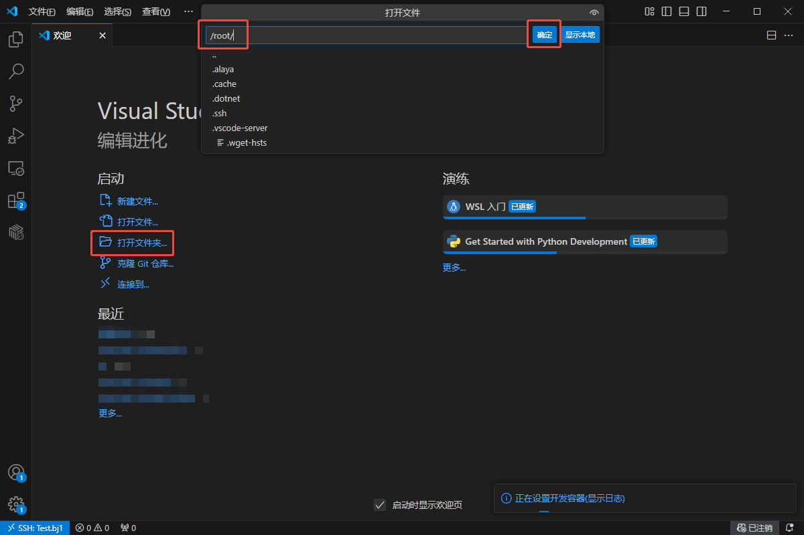

新建终端，在终端中安装miniconda，并确认**安装在/root目录**下：

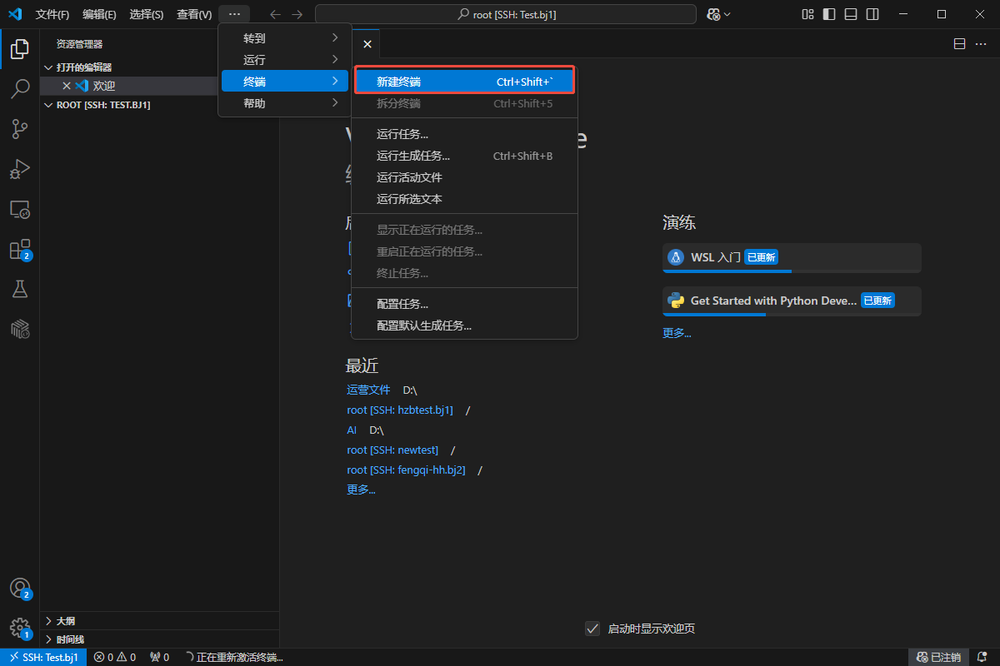

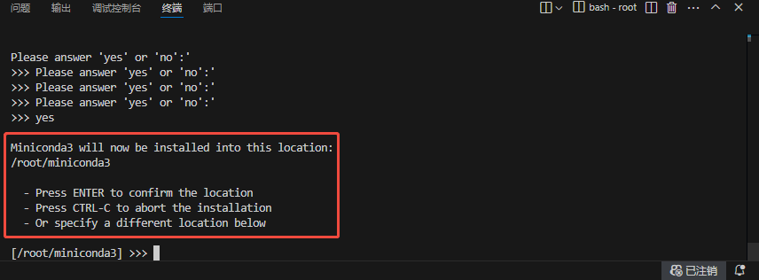

- Conda配置方法

```bash
# 下载最新版 Miniconda (Linux 64位)
curl -L -O https://mirrors.tuna.tsinghua.edu.cn/anaconda/miniconda/Miniconda3-latest-Linux-x86_64.sh
# 运行安装脚本
bash Miniconda3-latest-Linux-x86_64.sh
# 安装时You can undo this by running `conda init --reverse $SHELL`?
# 此项必须选择Yes,安装完成后重启终端conda命令才能生效~

# 验证安装
conda --version
# 应该显示类似：conda 25.1.1

# 添加清华 conda 源
conda config --add channels https://mirrors.tuna.tsinghua.edu.cn/anaconda/pkgs/free/
conda config --add channels https://mirrors.tuna.tsinghua.edu.cn/anaconda/pkgs/main/
conda config --add channels https://mirrors.tuna.tsinghua.edu.cn/anaconda/cloud/conda-forge/
# 显示通道URL
conda config --set show_channel_urls yes
# 设置 pip 使用清华源
pip config set global.index-url https://pypi.tuna.tsinghua.edu.cn/simple

```
成功安装miniconda后，需配置python解释器——新建一个python文件，点击远端页面右下角的python版本号，切换到conda环境中的python：
或使用`Ctrl+Shift+P`快捷键打开命令窗口，输入"Select Interpreter"，更换python解释器。
>**重要 ❗**：如不切换，调用GPU时将无法复用配置的环境，出现找不到已安装包的报错！

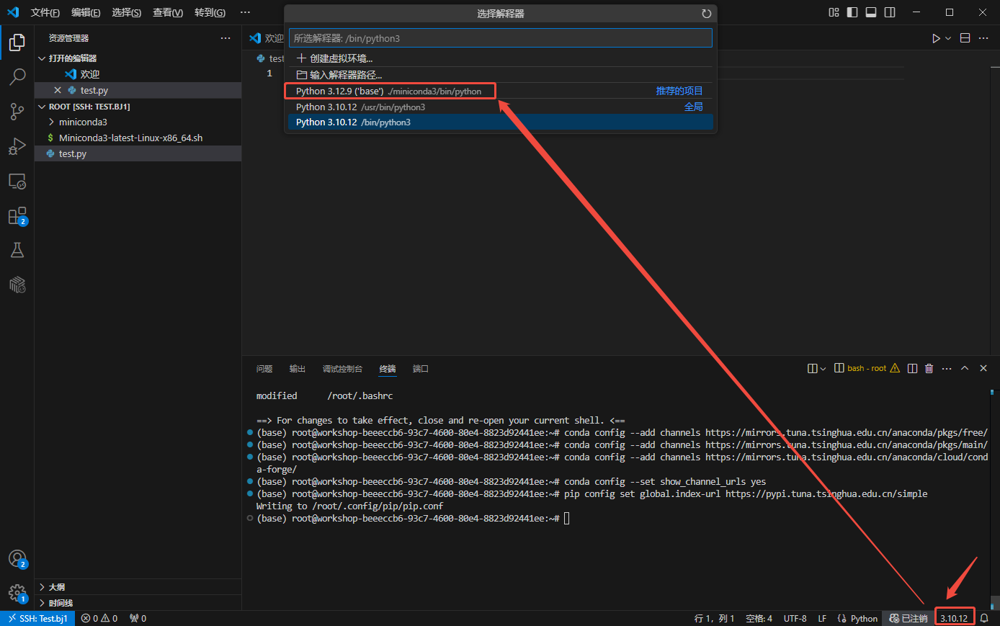

远端页面右下角的版本号出现conda环境名，环境切换成功：

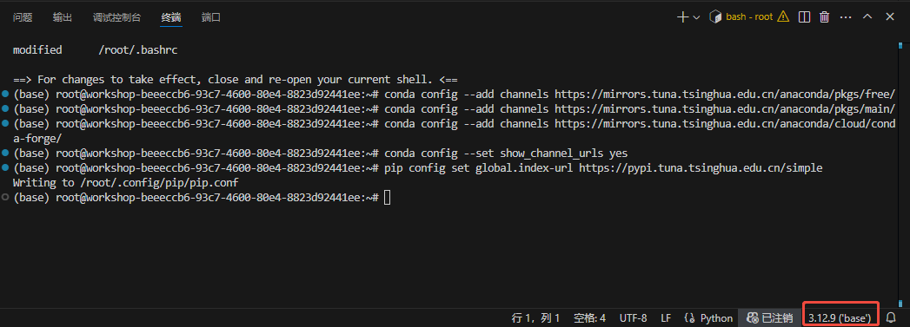

接着安装torch，推荐安装12.4版以适配GPU：
>配置科学上网后将显著提升下载安装速度，具体步骤参考[学术资源加速](#学术资源加速)。

```bash
#安装cuda 12.4
pip3 install torch torchvision torchaudio --index-url https://download.pytorch.org/whl/cu124
```
使用以下代码测试cuda是否安装成功，以及是否与当前环境GPU兼容：

```python
import torch
import time

def test_cuda_availability():
    print("\n======= CUDA 测试 =======")
    # 检查 CUDA 是否可用
    cuda_available = torch.cuda.is_available()
    print(f"PyTorch CUDA 可用: {'✅是' if cuda_available else '❌否'}")

    if cuda_available:
        # 打印 CUDA 版本和设备信息
        print(f"PyTorch CUDA 版本: {torch.version.cuda}")
        print(f"当前 GPU 设备: {torch.cuda.get_device_name(0)}")
        print(f"GPU 数量: {torch.cuda.device_count()}")
    else:
        print("⚠️ 请检查 CUDA 和 PyTorch 是否安装正确！")
    print("========================\n")

def test_gpu_speed():
    print("\n======= GPU 速度测试 =======")
    # 创建一个大型张量
    x = torch.randn(10000, 10000)
    
    # CPU 计算
    start_time = time.time()
    x_cpu = x * x
    cpu_time = time.time() - start_time
    print(f"CPU 计算时间: {cpu_time:.4f} 秒")

    if torch.cuda.is_available():
        # 移动到 GPU 计算
        x_gpu = x.to('cuda')
        start_time = time.time()
        x_gpu = x_gpu * x_gpu
        torch.cuda.synchronize()  # 确保 GPU 计算完成
        gpu_time = time.time() - start_time
        print(f"GPU 计算时间: {gpu_time:.4f} 秒")
        print(f"GPU 比 CPU 快: {cpu_time / gpu_time:.1f} 倍")
    else:
        print("⚠️ GPU 不可用，跳过测试")
    print("==========================\n")

def test_training():
    print("\n======= 简单训练测试 =======")
    # 定义一个极简神经网络
    model = torch.nn.Sequential(
        torch.nn.Linear(10, 100),
        torch.nn.ReLU(),
        torch.nn.Linear(100, 1)
    )
    
    # 如果有 GPU，将模型和数据移到 GPU
    device = 'cuda' if torch.cuda.is_available() else 'cpu'
    model = model.to(device)
    print(f"使用设备: {device.upper()}")

    # 模拟数据
    X = torch.randn(1000, 10).to(device)
    y = torch.randn(1000, 1).to(device)

    # 训练循环
    optimizer = torch.optim.SGD(model.parameters(), lr=0.01)
    start_time = time.time()
    for epoch in range(5):
        optimizer.zero_grad()
        output = model(X)
        loss = torch.nn.functional.mse_loss(output, y)
        loss.backward()
        optimizer.step()
        print(f"Epoch {epoch + 1}, Loss: {loss.item():.4f}")
    
    total_time = time.time() - start_time
    print(f"总训练时间: {total_time:.2f} 秒")
    print("==========================\n")

if __name__ == "__main__":
    test_cuda_availability()
    test_gpu_speed()
    test_training()
```

将代码复制到test.py中，在代码区右击GPU RUN运行。将资源选择为GPU，其余不变：


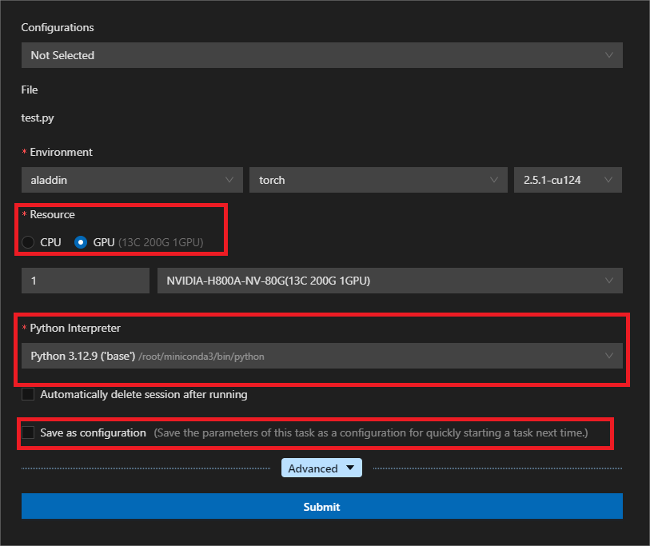

输出内容案例：
```
======= CUDA 测试 =======
 PyTorch CUDA 可用: ✅是
 PyTorch CUDA 版本: 12.4
 当前 GPU 设备: [你选择的设备]
 GPU 数量: 1
========================

======= GPU 速度测试 =======
 CPU 计算时间: 0.0487 秒
 GPU 计算时间: 0.0975 秒
 GPU 比 CPU 快: 0.5 倍
==========================

======= 简单训练测试 =======
使用设备: CUDA
Epoch 1, Loss: 0.9516
Epoch 2, Loss: 0.9486
Epoch 3, Loss: 0.9462
Epoch 4, Loss: 0.9442
Epoch 5, Loss: 0.9424
总训练时间: 1.93 秒
==========================
 
```

## 数据

### 概要

公测期间，存储空间暂不支持扩展，同时我们将每种套餐的免费存储权益均开放至100G。请留意存储占用，不要超出100G，否则可能出现workshop无法正常启动等问题。

#### 数据保留规则

自当前算力套餐失效、账号不享套餐权益起，若15日内未登录过AladdinEdu平台，存储资源将会自动回收。

### 上传下载数据
>文件传输的平均速度为2-3M/s，峰值约为5M/s。如传输速度缓慢，可能是由于带宽负载较大，请稍后再试。

#### 小文件传输（M级别文件）

选择工作目录后，可通过直接拖拽至工作区来导入文件。

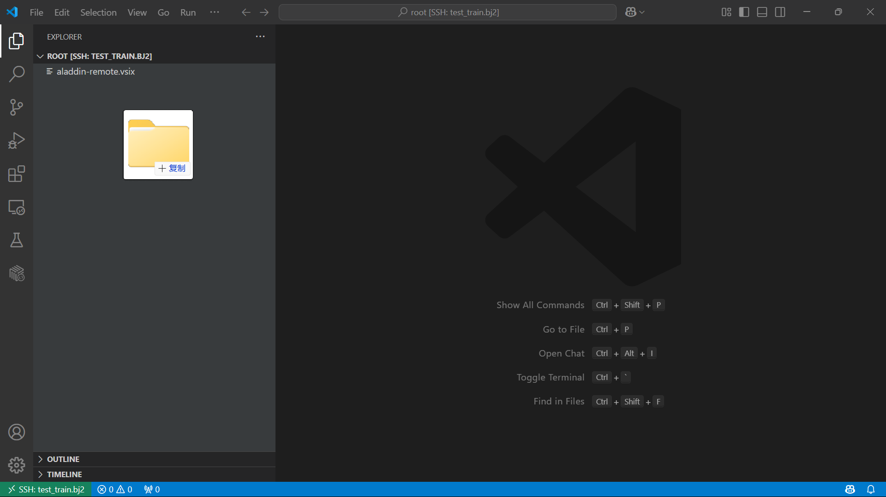

#### 大文件传输（G级别文件，强烈推荐）

1.查看ssh配置文件

workshop创建成功后，查看ssh的配置文件：

- 按`Ctrl+Shift+P`快捷键，选择“Remote-SSH: Open SSH Configuration File”

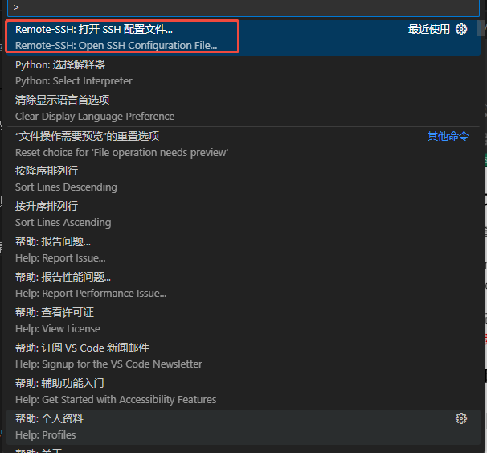
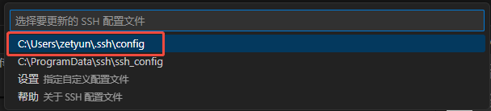

在配置文件中找到workshop名称对应的Host，其中IdentityFile为密钥文件目录：

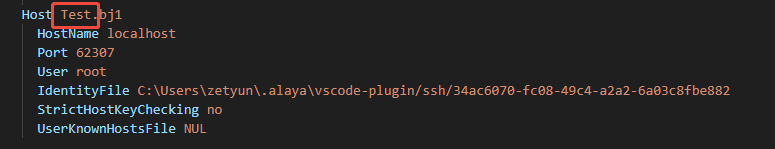

2.配置sftp软件，以FlieZilla Client 为例
<span style="color: red; font-weight: bold">连接、传输时需确保 workshop 处于 running 状态</span>

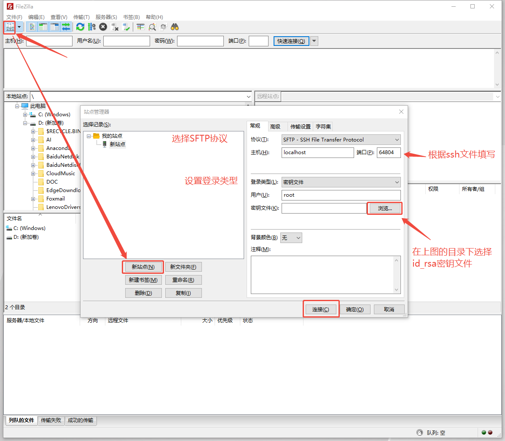

3.向/root目录下传输文件

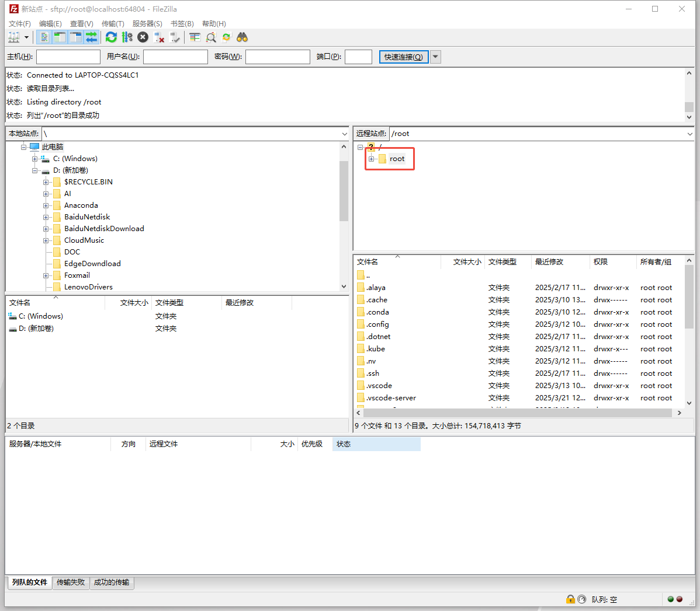

#### scp方式（推荐Mac用户及Linux用户使用）

```bash
#上传命令
scp -r /本地/目录 ${workshop name}:/root/路径

#下载命令
scp -r ${workshop name}:/root/路径 /本地/路径
```

#### 公网网盘传输

正在施工中，敬请期待~

## GPU调用

>对python文件支持GPU Debug、GPU Run、Run Task；对shell文件支持Run Shell、Run Task。
以上任务运行均与workshop状态无关，您可在任务运行时停止workshop。

除了Run Task为训练态，其他功能均为开发态，即会有Log输出，但是不会保存。

在对应文件中右击，点击相应功能后弹出如下配置页面：
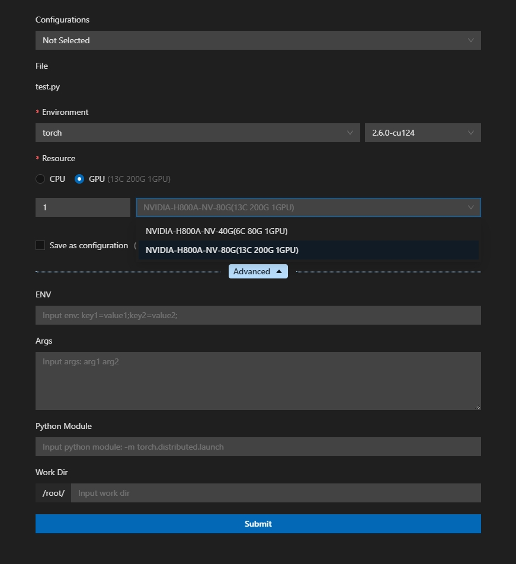

- 参数介绍

| 参数名称                  | 说明                                                                 | 备注                                                                 |
|---------------------------|----------------------------------------------------------------------|----------------------------------------------------------------------|
| Configurations        | 查看已保存的配置信息                                                 | 可快速载入历史配置                                                   |
| Environment          | GPU运行的基础镜像                                                   | <span style="color: red">※ 使用conda环境则此处选择的镜像无效</span> |
| Resource              | GPU调用时分配到的资源                                                 | - 可选择显卡数量、型号<br>- 卡型号后内容为系统自动适配的CPU、内存[^1]<br><span style="color: red">※ 40G卡型暂不支持使用多卡</span> |
| Save as configuration | 保存当前GPU调用配置                                                 | 勾选后可供下次直接调用                                               |
| ENV                   | 环境变量配置                                                       | 支持键值对形式注入                                                   |
| Args                  | 命令行参数                                                         | 按需传入执行参数                                                     |
| Python Module         | Python模块入口                                                     | 支持Python模块                                       |
| Work Dir              | 工作目录路径                                                       | 不同项目可配置不同路径                                               |

[^1]: "6C 80G"是指为每卡分配了6个CPU与80G内存，以此类推。每并行度可用CPU数为10，存储为121G，超出后将报错超出quota；

调用GPU（所有类型）成功后，对Running状态下的进程可以通过右击远端页面中的 DEVELOP SESSION 进行下列操作：

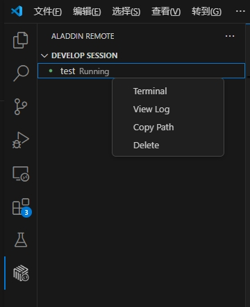

- 操作介绍

| 操作       | 功能描述                     | 使用场景               |
|:----------:|:---------------------------:|:---------------------:|
| Terminal   | 打开运行终端，实时查看进程状态和GPU使用率 | 实时监控任务状态       |
| View Log   | 查看任务实时/历史运行日志      | 检查执行结果和错误     |
| Copy Path  | 复制log目录路径（Run Task专属） | 在终端快速访问日志目录 |
| Delete     | 手动终止进程并释放资源        | 停止异常任务          |

### GPU Debug

提供 Debug 调试功能，支持断点调试，并在调试控制台中查看输出信息。

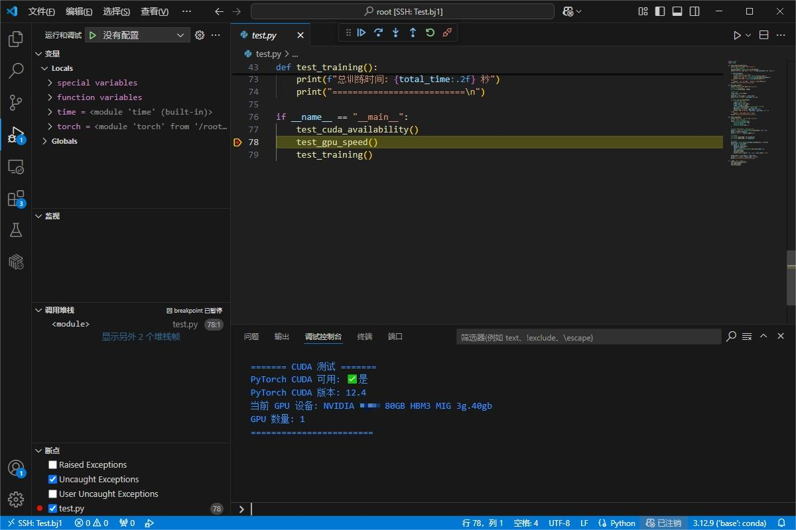

### GPU Run

GPU Run提供与VSCode直接Run代码类似的开发态执行体验，运行Log默认会在输出中展示。运行结束后将会自动释放资源，停止计费。

### Run Shell

与GPU Run类似，Run Shell可用于运行sh脚本，也可用于编译环境，但如上文所说编译后的环境只会保存在临时存储中，关闭workshop后会清除。
>注：sh文件中需要添加conda activate [你的环境名]命令，或在.bashrc文件中直接激活conda环境。

### Run Task

Run Task作为唯一训练态功能，可用于运行多worker分布式任务（torchrun）。此时GPU并行度=GPU数*worker数。

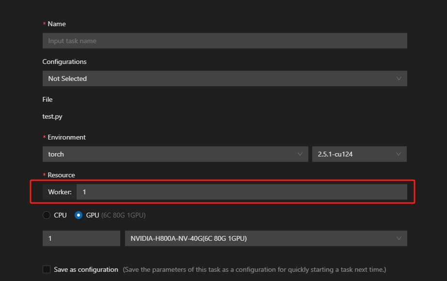

运行Task时默认不会有Log输出。如需查看日志，需在session中等待Task状态切换为Running后，右击“View log”查看；或右击“copy path”，复制日志文件目录到终端中通过cd打开查看。

同时，Run Task支持在本地VSCode中查看或下载日志。

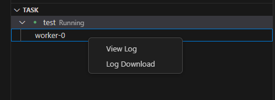 
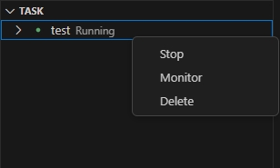

- 操作介绍

| 操作     | 功能描述                     |
|:--------:|:---------------------------:|
| View Log   | 查看Task的日志信息           |
| Log Download  | 下载Task的日志信息到本地           |
| Stop     | 停止当前正在运行的Task       |
| Monitor  | 资源监视器，可查看CPU、内存、GPU使用情况 |
| Delete   | 删除Task的日志信息           |

>本地VSVode中，该Delete功能会停止Task并删除日志信息。

## 充值与计费

### 充值

当前仅支持通过客服充值算力。在付款页面扫描企业微信二维码，添加客服获取最新价格与优惠政策。

### 发票

AladdinEdu平台支持开票，项目名称为“技术服务费”。如有开票需求，可联系客服办理。

### 计费

AladdinEdu平台目前采用订阅制计费方式。用户可订阅不同类型套餐，套餐权益见下表：
| 套餐名称               | 尝鲜版 | 初级版 | 高级版 | 扩展包 |
|:---------------------:|:------:|:------:|:------:|:------:|
| 套餐内算力/DCU        | 20     | 56.6   | 500    | 10     |
| GPU并行度             | 2      | 4      | 8      | -      |
| 免费存储空间/G        | 30     | 60     | 100    | -      |
| 非教育用户费用/元     | 135    | 365    | 3100   | 67.5    |
| 教育用户费用/元        | 119    | 325    | 2750   | 59.5     |

※ DCU，即度，AladdinEdu平台采用的算力基本计量单位，1DCU=A100（80GB SXM版）实际运行[^实际运行]1h（算力量=312TFLOPS*1h）。

AladdinEdu平台目前提供两种GPU，规格如下：
| 规格参数               | DC100（Hopper）40G         | DC100（Hopper）80G         |
|:-----------------------:|:---------------------------:|:---------------------------:|
| 显存大小          | 40GB                      | 80GB                      |
| 算力定价          | 1.28 DCU/H                | 2.56 DCU/H                |
| 并行度占用        | 1                         | 2                         |


### 结转
套餐有效期为30天，期间未消耗的算力将且仅将结转30天，结转后的算力处于未激活状态。在结转周期内再次订阅，这部分算力将被激活，但无法再次结转；若无再次订阅，这部分算力将无法继续使用。

举例：
小明在4月1日订阅了一个月尝鲜版套餐，在4月30日剩余10DCU算力未使用， 那么在5月1日账号内仍会留有10DCU算力，但该部分算力尚处于未激活状态。小明在5月15日再次订阅了一个月初级版套餐，此时10DCU算力激活，账户内合计有66.6DCU算力。假设小明在6月13日前没有消耗任何算力，那么在6月14日，10DCU过期，其算力余额将为56.6DCU，且处于未激活状态。

### 升级与续费
订阅更高权益的套餐时，支付成功后升级将立即生效，有效期为30天。原套餐算力的有效期同步刷新，将在30天后进入结转周期。

如果订阅更低权益的套餐，或续费相同权益的套餐，新订阅会从当前周期结束后开始生效。在当前周期内无法使用下个周期的算力。

### 总结
算力扣减顺序为：结转算力>扩展包>（低级）套餐内算力>（高级）套餐算力。

[^实际运行]:只在占用GPU时计费，其他时间则不计费，如文件上传与下载、环境配置等。
