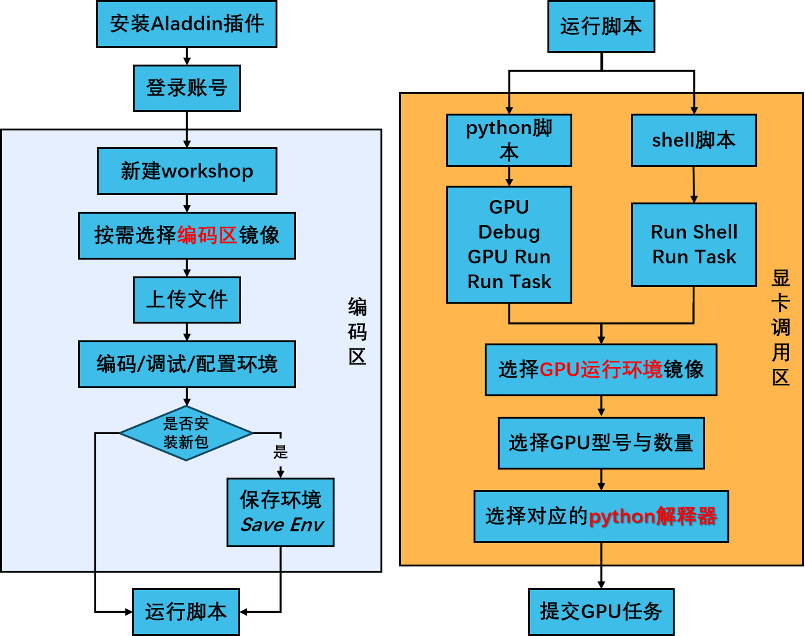
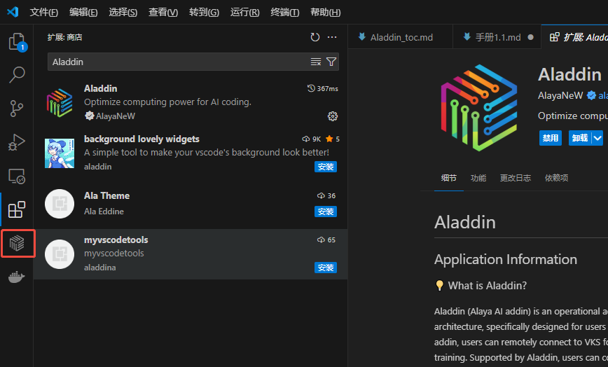

# AladdinEdu使用手册

# 简介

> 严肃声明：严禁挖矿，一经发现一律清空所有算力并永久封号！

🔹欢迎关注公众号“九章云极AladdinEdu”，获取更多活动与福利！

🔹教学视频：[AladdinEdu平台使用教程（VSCode版）](https://www.bilibili.com/video/BV1bKLjz7EQk/?share_source=copy_web&vd_source=785ba0f4a2bb0a864e047ca2c9d18fed
) 

🔹[AladdinEdu，同学们用得起的H卡算力平台](https://www.aladdinedu.com/)。

🔹必看文档：

    1. [快速开始](#快速开始)

    2. [数据](#数据)
  
    3. [充值与计费](#充值与计费)

使用流程图：

   

架构图：

   

# 学术资源加速

## 公开资源

```bash
# GitHub加速
git config --global url."https://gh-proxy.com/github.com/".insteadOf "https://github.com/"
```

## 下载平台已缓存模型
平台中我们缓存了很多开源模型，可以加速下载。

1. 设置HF_ENDPOINT环境变量：
```bash
export HF_ENDPOINT=http://hfmirror.mas.zetyun.cn:8082
```
2. 查看模型缓存列表：

```bash
# 展示所有已缓存模型名称
 curl -s http://hfmirror.mas.zetyun.cn:8082/repos | grep -oP '(?<=<div class="header">)[^<]+' | sort | sort
```

   <details>
      <summary>点击展开 / 收起模型列表</summary>

      ACE-Step/ACE-Step-v1-chinese-rap-LoRA
      AI-MO/NuminaMath-1.5
      AI-MO/NuminaMath-TIR
      AIDC-AI/Ovis1.6-Gemma2-9B
      AgentGym/AgentEval
      AgentGym/AgentEvol-7B
      AlayaNeW/QA_from_CoVLA_zh
      AlphaGaO/DeepSeek-V3-0324-Fused-8E-39B-Unhealed-Preview
      BAAI/OpenSeek-Pretrain-100B
      BAAI/ShareRobot
      BAAI/bge-m3
      BAAI/bge-reranker-base
      Bofeee5675/TongUI-143K
      ByteDance/Dolphin
      CEIA-UFG/Gemma-3-Gaia-PT-BR-4b-it
      Comfy-Org/ACE-Step_ComfyUI_repackaged
      Comfy-Org/HunyuanVideo_repackaged
      Comfy-Org/Wan_2.1_ComfyUI_repackaged
      Comfy-Org/flux1-schnell
      Comfy-Org/sigclip_vision_384
      DataCanvas/Alaya-7B-Base
      Efficient-Large-Model/NVILA-Lite-15B
      FacehugmanIII/4x_foolhardy_Remacri
      FunAudioLLM/SenseVoiceSmall
      GraydientPlatformAPI/flux-clip
      HuggingFaceTB/SmolVLM-256M-Instruct
      Jize1/GTA
      Kijai/HunyuanVideo_comfy
      Kijai/WanVideo_comfy
      Kijai/llava-llama-3-8b-text-encoder-tokenizer
      Laxhar/noobai-XL-1.1
      LeonJoe13/Sonic
      LiheYoung/depth-anything-large-hf
      OpenGVLab/InternVL2_5-26B
      OpenGVLab/InternVL2_5-38B
      OpenGVLab/InternVL2_5-4B
      OpenGVLab/InternVL2_5-78B
      OpenGVLab/InternVL2_5-8B
      OpenGVLab/InternVL3-14B-AWQ
      PRIME-RL/Eurus-2-RL-Data
      Qwen/QVQ-72B-Preview
      Qwen/QwQ-32B
      Qwen/QwQ-32B-AWQ
      Qwen/QwQ-32B-Preview
      Qwen/Qwen-7B
      Qwen/Qwen1.5-0.5B-Chat-AWQ
      Qwen/Qwen1.5-0.5B-Chat-GPTQ-Int4
      Qwen/Qwen2-0.5B-Instruct-AWQ
      Qwen/Qwen2-0.5B-Instruct-GGUF
      Qwen/Qwen2-0.5B-Instruct-MLX
      Qwen/Qwen2-7B
      Qwen/Qwen2-7B-Instruct
      Qwen/Qwen2-VL-2B-Instruct
      Qwen/Qwen2-VL-7B-Instruct
      Qwen/Qwen2.5-0.5B
      Qwen/Qwen2.5-0.5B-Instruct
      Qwen/Qwen2.5-1.5B
      Qwen/Qwen2.5-1.5B-Instruct
      Qwen/Qwen2.5-14B-Instruct
      Qwen/Qwen2.5-32B
      Qwen/Qwen2.5-32B-Instruct
      Qwen/Qwen2.5-72B
      Qwen/Qwen2.5-72B-Instruct
      Qwen/Qwen2.5-7B
      Qwen/Qwen2.5-7B-Instruct
      Qwen/Qwen2.5-Coder-0.5B-Instruct-AWQ
      Qwen/Qwen2.5-Math-7B
      Qwen/Qwen2.5-Omni-7B
      Qwen/Qwen2.5-VL-32B-Instruct
      Qwen/Qwen2.5-VL-32B-Instruct-AWQ
      Qwen/Qwen2.5-VL-3B-Instruct
      Qwen/Qwen2.5-VL-72B-Instruct
      Qwen/Qwen2.5-VL-7B-Instruct
      Qwen/Qwen3-0.6B
      Qwen/Qwen3-0.6B-Base
      Qwen/Qwen3-0.6B-FP8
      Qwen/Qwen3-1.7B
      Qwen/Qwen3-1.7B-Base
      Qwen/Qwen3-1.7B-FP8
      Qwen/Qwen3-14B
      Qwen/Qwen3-14B-Base
      Qwen/Qwen3-14B-FP8
      Qwen/Qwen3-235B-A22B
      Qwen/Qwen3-235B-A22B-FP8
      Qwen/Qwen3-30B-A3B
      Qwen/Qwen3-30B-A3B-Base
      Qwen/Qwen3-30B-A3B-FP8
      Qwen/Qwen3-32B
      Qwen/Qwen3-32B-FP8
      Qwen/Qwen3-4B
      Qwen/Qwen3-4B-Base
      Qwen/Qwen3-4B-FP8
      Qwen/Qwen3-8B
      Qwen/Qwen3-8B-Base
      Qwen/Qwen3-8B-FP8
      RUC-AIBOX/STILL-2
      RUC-AIBOX/STILL-3-TOOL-32B
      RUC-AIBOX/ds_qwen_1.5B-iter1_steps60-iter2_steps60-iter3_steps60-iter4_steps60
      RUC-AIBOX/long_form_thought_data_5k
      RedHatAI/Qwen2.5-VL-72B-Instruct-quantized.w8a8
      SGLang/DeepSeek-V3-NextN
      SamuelYang/bookcorpus
      Shakker-Labs/FLUX.1-dev-ControlNet-Union-Pro-2.0
      SynthLabsAI/Big-Math-RL-Verified
      THUDM/chatglm-6b
      THUDM/glm-4v-9b
      Virtuos-rnd/flux_upscale_model
      Vvilams/t5xxl_fp16
      Wan-AI/Wan2.1-I2V-14B-720P
      Wan-AI/Wan2.1-T2V-1.3B
      Wan-AI/Wan2.1-T2V-14B
      Wan-AI/Wan2.1-VACE-1.3B
      Wan-AI/Wan2.1-VACE-14B
      XLabs-AI/flux-furry-lora
      XLabs-AI/flux-lora-collection
      YkiWu/hoi4d_release
      agentica-org/DeepCoder-14B-Preview
      agentica-org/DeepScaleR-Preview-Dataset
      aharley/pointodyssey
      baichuan-inc/Baichuan-7B
      bert-base-uncased/paths-info
      black-forest-labs/FLUX.1-Canny-dev
      black-forest-labs/FLUX.1-Depth-dev-lora
      black-forest-labs/FLUX.1-Fill-dev
      black-forest-labs/FLUX.1-Redux-dev
      black-forest-labs/FLUX.1-dev
      black-forest-labs/FLUX.1-schnell
      bookcorpus/bookcorpus
      cagliostrolab/animagine-xl-3.1
      calcuis/wan-gguf
      camenduru/SMPLer-X
      city96/Wan2.1-I2V-14B-480P-gguf
      city96/Wan2.1-I2V-14B-720P-gguf
      cognitivecomputations/DeepSeek-V3-0324-AWQ
      comfyanonymous/flux_text_encoders
      deepseek-ai/DeepSeek-Prover-V2-671B
      deepseek-ai/DeepSeek-R1
      deepseek-ai/DeepSeek-R1-0528
      deepseek-ai/DeepSeek-R1-Distill-Llama-70B
      deepseek-ai/DeepSeek-R1-Distill-Llama-8B
      deepseek-ai/DeepSeek-R1-Distill-Qwen-1.5B
      deepseek-ai/DeepSeek-R1-Distill-Qwen-14B
      deepseek-ai/DeepSeek-R1-Distill-Qwen-32B
      deepseek-ai/DeepSeek-R1-Distill-Qwen-7B
      deepseek-ai/DeepSeek-R1-Zero
      deepseek-ai/DeepSeek-V3
      deepseek-ai/DeepSeek-V3-0324
      deepseek-ai/DeepSeek-V3-Base
      deepseek-ai/Janus-Pro-7B
      deepseek-ai/deepseek-r1-distill-qwen-1.5b
      deepseek-ai/deepseek-r1-distill-qwen-7b
      deepseek-ai/deepseek-vl2-tiny
      echo840/MonkeyOCR
      eugenesiow/Div2k
      facebook/esm2_t48_15B_UR50D
      gaia-benchmark/GAIA
      goodfellowliu/Flickr2K
      google-bert/bert-base-uncased
      google/flan-t5-xxl
      google/gemma-3-12b-it
      google/gemma-3-1b-it
      google/gemma-3-27b-it
      google/gemma-3-4b-it
      google/medgemma-27b-text-it
      google/medgemma-4b-it
      google/siglip-so400m-patch14-384
      google/t5-v1_1-xxl
      google/vit-base-patch16-224
      hf-internal-testing/llama-tokenizer
      hongchi/wildrgbd
      hongchi/wildrgbd
      huxueyu/0.5B_en_train_16_20250129-134441
      huxueyu/0.5B_en_train_16_zh_train_16_fr_train_16_es_train_16_20250129-162020
      huxueyu/0.5B_en_train_1_20250129-135620
      huxueyu/0.5B_en_train_1_es_train_16_20250130-042204
      huxueyu/0.5B_en_train_1_es_train_1_20250130-054545
      huxueyu/0.5B_en_train_1_es_train_256_20250130-030948
      huxueyu/0.5B_en_train_1_es_train_4_20250130-050028
      huxueyu/0.5B_en_train_1_es_train_64_20250130-034602
      huxueyu/0.5B_en_train_1_fr_train_16_20250130-003217
      huxueyu/0.5B_en_train_1_fr_train_1_20250130-015514
      huxueyu/0.5B_en_train_1_fr_train_256_20250129-232036
      huxueyu/0.5B_en_train_1_fr_train_4_20250130-011017
      huxueyu/0.5B_en_train_1_fr_train_64_20250129-235612
      huxueyu/0.5B_en_train_1_zh_train_16_20250129-204850
      huxueyu/0.5B_en_train_1_zh_train_1_20250129-221038
      huxueyu/0.5B_en_train_1_zh_train_1_fr_train_1_es_train_1_20250129-170723
      huxueyu/0.5B_en_train_1_zh_train_256_20250129-193633
      huxueyu/0.5B_en_train_1_zh_train_4_20250129-212622
      huxueyu/0.5B_en_train_1_zh_train_64_20250129-201242
      huxueyu/0.5B_en_train_256_20250129-134208
      huxueyu/0.5B_en_train_256_zh_train_256_fr_train_256_es_train_256_20250129-161615
      huxueyu/0.5B_en_train_4_20250129-134723
      huxueyu/0.5B_en_train_4_zh_train_4_fr_train_4_es_train_4_20250129-162944
      huxueyu/0.5B_en_train_64_20250129-134325
      huxueyu/0.5B_en_train_64_zh_train_64_fr_train_64_es_train_64_20250129-161732
      huxueyu/0.5B_es_train_16_20250130-122336
      huxueyu/0.5B_es_train_1_20250130-123637
      huxueyu/0.5B_es_train_256_20250130-122107
      huxueyu/0.5B_es_train_4_20250130-122634
      huxueyu/0.5B_es_train_64_20250130-122217
      huxueyu/0.5B_fr_train_16_20250129-152356
      huxueyu/0.5B_fr_train_1_20250129-153638
      huxueyu/0.5B_fr_train_256_20250129-152136
      huxueyu/0.5B_fr_train_4_20250129-152648
      huxueyu/0.5B_fr_train_64_20250129-152238
      huxueyu/0.5B_zh_train_16_20250129-143442
      huxueyu/0.5B_zh_train_1_20250129-144611
      huxueyu/0.5B_zh_train_256_20250129-143226
      huxueyu/0.5B_zh_train_4_20250129-143719
      huxueyu/0.5B_zh_train_64_20250129-143327
      huxueyu/3B_fr_train_1_20250131-173250
      internlm/internlm2-chat-7b
      jinaai/jina-clip-v2
      juaner0211/Animal_Crossing_style_flux_lora
      laion/CLIP-ViT-bigG-14-laion2B-39B-b160k
      latent-action-pretraining/LAPA-7B-openx
      leapfusion-image2vid-test/image2vid-960x544
      leptonai/EAGLE-Llama-3.1-70B-Instruct
      leptonai/EAGLE-Llama-3.1-8B-Instruct
      lerobot/aloha_sim_insertion_human
      lerobot/diffusion_pusht
      lerobot/pusht
      lingshu-medical-mllm/Lingshu-32B
      lingshu-medical-mllm/Lingshu-7B
      liuqingquan/sd35_clip_l
      llava-hf/llava-interleave-qwen-0.5b-hf
      llava-hf/llava-v1.6-mistral-7b-hf
      lokCX/4x-Ultrasharp
      meta-llama/Llama-2-7b
      meta-llama/Llama-3.1-70B-Instruct
      meta-llama/Llama-3.1-8B-Instruct
      meta-llama/Llama-3.2-11B-Vision-Instruct
      meta-llama/Llama-3.3-70B-Instruct
      meta-llama/Llama-4-Scout-17B-16E
      meta-llama/Llama-4-Scout-17B-16E-Instruct
      meta-llama/Meta-Llama-3-8B
      meta-llama/Meta-Llama-3-8B-Instruct
      microsoft/Phi-4-multimodal-instruct
      moonshotai/Kimi-Audio-7B-Instruct
      mtoan65/ATLAS_nnUNetv2
      nari-labs/Dia-1.6B
      nvidia/Llama-3_1-Nemotron-Ultra-253B-v1
      omlab/VLM-R1
      open-r1/OpenR1-Math-220k
      open-thoughts/OpenThinker-7B
      openai/clip-vit-base-patch32
      openai/clip-vit-large-patch14
      openai/whisper-large
      openai/whisper-tiny
      openbmb/MiniCPM-V-2_6
      openbmb/MiniCPM-o-2_6
      openbmb/MiniCPM3-4B
      openbmb/RLAIF-V-12B
      openvla/modified_libero_rlds
      openvla/openvla-7b
      perplexity-ai/r1-1776
      qihoo360/Light-R1-32B-DS
      qihoo360/Light-R1-7B-DS
      qwbu/univla-7b
      qwbu/univla-latent-action-model
      qwen/Qwen1.5-1.8B-Chat
      robotics-diffusion-transformer/rdt-1b
      runwayml/stable-diffusion-v1-5
      stabilityai/sdxl-turbo
      stabilityai/stable-diffusion-3.5-large
      stabilityai/stable-video-diffusion-img2vid-xt
      stabilityai/stable-video-diffusion-img2vid-xt-1-1
      tencent/DepthCrafter
      tencent/HunyuanVideo
      unsloth/DeepSeek-R1-GGUF
      vidore/colpali-v1.2
      vidore/colpaligemma-3b-pt-448-base
      vidore/colqwen2.5-base
      vidore/colqwen2.5-v0.2
      waanqii/SMPLest-X
      wtcherr/unsplash_10k_canny
      x-humanoid-robomind/RoboMIND
      xlabs-ai/xflux_text_encoders
      xtuner/llava-llama-3-8b-v1_1-transformers
      yentinglin/aime_2025
      yulan-team/YuLan-Mini
      zheng95z/rgb-to-x
      zhzhen23/DynVQA
      zixianma/mnms

   </details>

>如有其他模型需求，可联系客服添加至缓存中~

3. 确保已安装 huggingface_hub 库的情况下，使用以下命令下载模型，下载平均速度可达60MB/s：
```
huggingface-cli download --resume-download Qwen/Qwen2.5-1.5B-Instruct --local-dir Qwen/Qwen2.5-1.5B-Instruct
```

   


# 快速开始

>AladdinEdu的使用主要分为三步，workshop创建 > 环境配置 > GPU调用，以下内容将围绕此流程展开。

## 插件初始化

_本节预计完成时间：2min_

### 插件安装
以VSCode版本为例

1. 在扩展中搜索Aladdin，点击安装：

   

2. 安装完成后可在活动栏看到Aladdin插件图标，安装成功：

   

### 账号登录
以VSCode版本为例

1. 点击Aladdin插件图标，选择Login Personal Account，弹窗后选择“打开”外部网站（AladdinEdu平台）：

   

2. 在AladdinEdu平台中使用手机号或账号密码登录，首次使用者请先注册：

   

3. 登录成功后点击“点击返回VSCode”，等待返回VSCode（如未自动跳转，请**手动**返回VSCode）。此时VSCode中出现弹窗，选择“打开”此URL，提示登录成功：

   

   

## workshop创建

_本节预计完成时间：3.5min_

>Stop时workshop中的数据（包括环境）将**全部保存**，因此重新Open后无需再次配置和上传数据。总之，workshop在，数据在。但是，自当前算力套餐失效起，若15日内未登录过AladdinEdu平台，存储将会被释放。

workshop为Aladdin插件的编码区，可在本地VSCode中连接远程服务器。

1. 在workshop菜单栏中点击 **+**，新建workshop：

   

2. 填写workshop名称，选择基础镜像与资源（推荐选择“CPU:2 MEM:8G”）：

   

- workshop启动参数介绍

| 参数名称       | 说明                                                                 | 备注                                                                 |
|----------------|----------------------------------------------------------------------|----------------------------------------------------------------------|
| **Environment** | 当前workshop使用的容器镜像                                         | 通常包含预装软件和基础运行环境                                       |
| **Resource**    | 当前workshop启动时分配到的CPU和内存资源                                    | 这些资源与GPU运行时是共享的，<br>GPU资源详情请查看[GPU调用](#gpu调用) |
| **ENV**        | 当前workshop运行时的环境变量                                         | 可用于配置应用参数、API密钥等敏感信息                                |

- 镜像介绍可查看[配置环境](#配置环境)

3. 点击提交后会出现插件的状态提示，配置预计在2min左右完成，提示由“Workshop is waiting for creating.”变为“Workshop is created.”：

   

4. 此时会弹出一个新窗口（后文统称为**远端页面**），选择"Linux"，之后远端页面中将自动安装相关插件：

   

5. 等待远端页面中出现Aladdin插件图标，workshop创建完成：

   

>若您3天以上未调用GPU，workshop将会**自动停止**。但请不用担心，workshop停止不会影响其中运行的GPU任务，下次使用重新启动即可~

## 运行Demo

_本节预计完成时间：约1min_
_以下操作均在远端页面中进行。_

<!-- 由于目前保存镜像功能暂未上线，直接将包装在镜像中将无法正常使用。**因此，如需自定义安装python包，均需从零开始配置环境**。
>注：强烈推荐按照本文说明，使用miniconda做环境配置。

1. workshop创建成功后，进入远端页面，选择打开/root目录：

   

2. 新建终端，在终端中安装miniconda，并确认**安装在/root目录**下：

   

   

- Conda配置方法

```bash
# 下载最新版 Miniconda (Linux 64位)
curl -L -O https://mirrors.tuna.tsinghua.edu.cn/anaconda/miniconda/Miniconda3-latest-Linux-x86_64.sh
# 运行安装脚本
bash Miniconda3-latest-Linux-x86_64.sh
# 安装时You can undo this by running `conda init --reverse $SHELL`?
# 此项必须选择Yes,安装完成后重启终端conda命令才能生效~

# 验证安装
conda --version
# 应该显示类似：conda 25.1.1

# 添加清华 conda 源
conda config --add channels https://mirrors.tuna.tsinghua.edu.cn/anaconda/pkgs/free/
conda config --add channels https://mirrors.tuna.tsinghua.edu.cn/anaconda/pkgs/main/
conda config --add channels https://mirrors.tuna.tsinghua.edu.cn/anaconda/cloud/conda-forge/
# 显示通道URL
conda config --set show_channel_urls yes
# 设置 pip 使用清华源
pip config set global.index-url https://pypi.tuna.tsinghua.edu.cn/simple

```
3. 成功安装miniconda后，需配置python解释器——新建一个python文件，点击远端页面右下角的python版本号，切换到conda环境中的python：

或使用`Ctrl+Shift+P`快捷键打开命令窗口，输入"Select Interpreter"，更换python解释器。
>**重要 ❗**：如不切换，调用GPU时将无法复用配置的环境，出现找不到已安装包的报错！

   

4. 远端页面右下角的版本号出现conda环境名，环境切换成功：

   

5. 接着安装torch，推荐安装12.4版以适配GPU：
>配置科学上网后将显著提升下载安装速度，具体步骤参考[学术资源加速](#学术资源加速)。

```bash
#安装cuda 12.4
pip3 install torch torchvision torchaudio --index-url https://download.pytorch.org/whl/cu124
``` -->

1. 打开/root目录文件夹，新建test.py文件，将测试代码复制到文件中，**在代码区或对文件右击**，选择GPU RUN运行：
   
   
>使用以下代码测试cuda是否安装成功，以及是否与当前环境GPU兼容：

```python
import torch
import time

def test_cuda_availability():
    print("\n======= CUDA 测试 =======")
    # 检查 CUDA 是否可用
    cuda_available = torch.cuda.is_available()
    print(f"PyTorch CUDA 可用: {'✅是' if cuda_available else '❌否'}")

    if cuda_available:
        # 打印 CUDA 版本和设备信息
        print(f"PyTorch CUDA 版本: {torch.version.cuda}")
        print(f"当前 GPU 设备: {torch.cuda.get_device_name(0)}")
        print(f"GPU 数量: {torch.cuda.device_count()}")
    else:
        print("⚠️ 请检查 CUDA 和 PyTorch 是否安装正确！")
    print("========================\n")

def test_gpu_speed():
    print("\n======= GPU 速度测试 =======")
    # 创建一个大型张量
    x = torch.randn(10000, 10000)
    
    # CPU 计算
    start_time = time.time()
    x_cpu = x * x
    cpu_time = time.time() - start_time
    print(f"CPU 计算时间: {cpu_time:.4f} 秒")

    if torch.cuda.is_available():
        # 移动到 GPU 计算
        x_gpu = x.to('cuda')
        start_time = time.time()
        x_gpu = x_gpu * x_gpu
        torch.cuda.synchronize()  # 确保 GPU 计算完成
        gpu_time = time.time() - start_time
        print(f"GPU 计算时间: {gpu_time:.4f} 秒")
        print(f"GPU 比 CPU 快: {cpu_time / gpu_time:.1f} 倍")
    else:
        print("⚠️ GPU 不可用，跳过测试")
    print("==========================\n")

def test_training():
    print("\n======= 简单训练测试 =======")
    # 定义一个极简神经网络
    model = torch.nn.Sequential(
        torch.nn.Linear(10, 100),
        torch.nn.ReLU(),
        torch.nn.Linear(100, 1)
    )
    
    # 如果有 GPU，将模型和数据移到 GPU
    device = 'cuda' if torch.cuda.is_available() else 'cpu'
    model = model.to(device)
    print(f"使用设备: {device.upper()}")

    # 模拟数据
    X = torch.randn(1000, 10).to(device)
    y = torch.randn(1000, 1).to(device)

    # 训练循环
    optimizer = torch.optim.SGD(model.parameters(), lr=0.01)
    start_time = time.time()
    for epoch in range(5):
        optimizer.zero_grad()
        output = model(X)
        loss = torch.nn.functional.mse_loss(output, y)
        loss.backward()
        optimizer.step()
        print(f"Epoch {epoch + 1}, Loss: {loss.item():.4f}")
    
    total_time = time.time() - start_time
    print(f"总训练时间: {total_time:.2f} 秒")
    print("==========================\n")

if __name__ == "__main__":
    test_cuda_availability()
    test_gpu_speed()
    test_training()
```


2. 修改启动选项：环境选择为torch，资源选择为GPU，python解释器按需选择，其余不变。提交运行：

   
> 若选择Save as configuration保存当前参数设置，之后调用GPU时将弹出Quick GPU Run窗口，列出内容为保存的Configuration。您可直接选用以快捷启用GPU Run，或通过+ New Create重新设置参数。
>    

输出内容案例：
```
======= CUDA 测试 =======
 PyTorch CUDA 可用: ✅是
 PyTorch CUDA 版本: 12.4
 当前 GPU 设备: [你选择的显卡]
 GPU 数量: 1
========================

======= GPU 速度测试 =======
 CPU 计算时间: 0.1339 秒
 GPU 计算时间: 0.0078 秒
 GPU 比 CPU 快: 17.3 倍
==========================

======= 简单训练测试 =======
使用设备: CUDA
Epoch 1, Loss: 1.0850
Epoch 2, Loss: 1.0827
Epoch 3, Loss: 1.0805
Epoch 4, Loss: 1.0784
Epoch 5, Loss: 1.0763
总训练时间: 0.17 秒
==========================
 
```

# 配置环境

## 概要

AladdinEdu内置了部分公共镜像，启动workshop时选择公共镜像就会自带相应框架的软件。如果自带的框架版本或Python版本不满足需求，请自行配置其他版本的框架或尝试Python方法。

1. 公共镜像

| 镜像类型 | 版本标签    | 包含内容                                                                 |
|:--------:|:-----------:|:------------------------------------------------------------------------|
| torch    | 2.5.1-cu124 | **核心包:**<br>`torch==2.5.1` `torchvision==0.20.1` `torchaudio==2.5.1` `cuda==12.4`<br>**附加包:**<br>`datasets` `transformers` `scikit-learn` `peft` `tiktoken` `blobfile` `sentencepiece` `protobuf` `deepspeed` |
| torch    | 2.6.0-cu124 | **核心包:**<br>`torch==2.6.0` `torchvision==0.21.0` `torchaudio==2.6.0` `cuda==12.4`<br>**附加包:**<br>同 2.5.1 版本 |
| jupyter-lab | 4.4.2 | **核心包:**<br>`jupyterlab==4.4.2` `torch==2.5.1+cu124` `cuda==12.4` |
|llama-factory | v0.9.3.dev0-cuda12.4-cudnn9-devel |**核心包:** <br>`llamafactory==0.9.3` `peft==0.15.1` `trl==0.9.6`<br>`accelerate==1.6.0` `transformers==4.51.3`<br>`torch==2.7.0` `cuda==12.6` | 
|llama-factory | v0.9.3.dev0-cuda12.1-cudnn9-devel |**核心包:** <br>`llamafactory==0.9.3` `peft==0.15.1` `trl==0.9.6`<br>`accelerate==1.6.0` `transformers==4.51.3`<br>`torch==2.7.0` `cuda==12.1` | 
|python | 3.10/3.11/3.12/3.13 | 纯净Python环境 |
| ubuntu   | 22.04       | 纯净 Ubuntu 22.04 系统                                                  |
> 注：jupyter-lab和llama-factory均已配conda。如您选用jupyter-lab和llam-factory作为workshop的基础镜像，后续配置环境时无需再手动安装conda。

2. 安装其他版本的Python： 推荐使用Miniconda创建其他版本的Python虚拟环境

```bash
# 构建一个虚拟环境名为：myenv，Python版本为3.7
conda create -n myenv python=3.7    

# 更新bashrc中的环境变量
conda init bash && source /root/.bashrc
# 切换到创建的虚拟环境：my-env
conda activate myenv

# 验证
python --version
```

3. 安装PyTorch： [参考链接](https://pytorch.org/get-started/previous-versions/)

>❗ 注意：
1️⃣ 通过Torch官方的conda安装命令，在国内安装的conda一般为非cuda版本，而是cpu版本（有bug），因此推荐用pip安装。并且，如果使用torch官方的pip命令，去掉-f/--index-url参数，这样可以走国内的pip源，速度更快；
2️⃣ 平台中目前所提供显卡支持的最低cuda版本为11.8，过低版本可能会导致计算性能损失。

4. 安装TensorFlow： [参考链接](https://www.tensorflow.org/install/pip?hl=zh-cn)

- **推荐的使用姿势**
  （1）如果平台内置的公共镜像中有您需要的Torch、TensorFlow等框架的相应版本，首选公共镜像。
  （2）如果以上条件都不满足，推荐使用Ubuntu系统，并自行安装miniconda进行环境配置。

## 私有镜像
AladdinEdu支持保存私有镜像，分为两种方式：本地上传私有镜像、保存workshop环境镜像。私有镜像可在控制台的私有镜像仓库、本地VSCode的ENVIRONMENTS中查看。

### 上传私有镜像
1. 打开电脑终端，逐条输入以下命令（以python3为例），推送成功后即成功在私有镜像仓库中新增镜像：
```python
# 登录
docker login registry.hd-01.alayanew.com:8443
# 拉取镜像
docker pull m.daocloud.io/docker.io/library/python:3
# 镜像tag重命名
docker tag m.daocloud.io/docker.io/library/python registry.hd-01.alayanew.com:8443/aladdinedu-e3fadb18-a994-470f-9a59-dde816718791/python:3
# 推送镜像
docker push registry.hd-01.alayanew.com:8443/aladdinedu-e3fadb18-a994-470f-9a59-dde816718791/python:3
```

> 用户名、密码在控制台的私有镜像仓库页查看

   
2. 在VSCode中登录Aladdin，并在Registry中填入私有镜像仓库的用户名、密码，登录私有镜像仓库：
   
3. 此时，ENVIRONMENTS中可查看私有镜像仓库，其中列出了上传的私有镜像，在workshop、GPU配置页中可直接选择使用。
   

### 保存workshop环境

如需将在workshop中使用的环境保存到私有镜像中，可按如下步骤操作。<span style="color: red; font-weight: bold">需注意，以下步骤要求 workshop 为 running 状态。<Span/>

1. **启动workshop**， 右键选择“Save Env”：
   
2. 选择私有镜像仓库，回车：
   
3. 输入要保存的workshop环境名，回车：
   
4. 输入tag，回车，等待保存：
   
5. 选择yes，更新当前workshop镜像：
   
  > 如果选择no，保存的workshop环境不会作用于当前workshop。
6. 更新成功后，私有镜像仓库中即会存有该环境，此时在workshop、GPU配置页中可选择使用该环境。
   

# 数据

## 概要

目前，AladdinEdu平台中的所有存储均为网络盘形式的文件存储，各套餐权益所含存储免费额度与可扩展上限见下表：

| 套餐类型       | 体验版      | 尝鲜版   | 初级版   | 高级版   |
|:----------------:|:---------:|:----------:|:----------:|:----------:|
| 免费文件存储空间 | 30G     | 30G      | 60G      | 100G     |
| 最大可扩展空间  | 不可扩展    | 500G     | 500G     | 2TB      |

>存储计费详见[文件存储计费](#文件存储计费)，如需更大的容量请扫码联系客服。

## 存储使用Tips

### 数据保留规则

自当前算力套餐失效、账号不享套餐权益起，若15日内未登录过AladdinEdu平台，存储资源将会自动回收。

## 上传下载数据
>文件传输的平均速度为2-3M/s，峰值约为5M/s。如传输速度缓慢，可能是由于带宽负载较大，请稍后再试。

### 小文件传输（M级别文件）

选择工作目录后，可通过直接拖拽至工作区来导入文件。

   

### 大文件传输（G级别文件，强烈推荐）

>传输文件时，推荐调整workshop的资源至可用范围内最大配额，保证传输过程稳定。

1. workshop创建成功后，查看ssh的配置文件：

- 按`Ctrl+Shift+P`快捷键，选择“Remote-SSH: Open SSH Configuration File”

   
   

- 在配置文件中找到workshop名称对应的Host，其中IdentityFile为密钥文件目录

   

2. 配置sftp软件，以FlieZilla Client 为例
<span style="color: red; font-weight: bold">连接、传输时需确保 workshop 处于 running 状态</span>

   

3. 向/root目录下传输文件

   

### scp方式（推荐Mac用户及Linux用户使用）

```bash
#上传命令
scp -r /本地/目录 ${workshop name}:/root/路径

#下载命令
scp -r ${workshop name}:/root/路径 /本地/路径
```

### 公网网盘传输

正在施工中，敬请期待~

# GPU调用

## 概要

>对python文件支持GPU Debug、GPU Run、Run Task；对shell文件支持Run Shell、Run Task。
以上任务运行均与workshop状态无关，您可在任务运行时停止workshop。

除了Run Task为训练态，其他功能均为开发态，即会有Log输出，但是不会保存。

### 配置页参数介绍

**在代码区或对对应文件右击**，点击相应功能后弹出如下配置页面：
   

| 参数名称                  | 说明                                                                 | 备注                                                                 |
|---------------------------|----------------------------------------------------------------------|----------------------------------------------------------------------|
| Configurations        | 查看已保存的配置信息                                                 | 可快速载入历史配置                                                   |
| Environment          | GPU运行的基础镜像                                                   |强烈推荐与workshop的镜像保持一致 |
| Resource              | GPU调用时分配到的资源                                                 | - 可选择显卡数量、型号<br>- 卡型号后内容为系统自动适配的CPU、内存<br><span style="color: red">※ 40G卡型暂不支持使用多卡</span> |
| Save as configuration | 保存当前GPU调用配置                                                 | 勾选后可供下次直接调用                                               |
| ENV                   | 环境变量配置                                                       | 支持键值对形式注入                                                   |
| Args                  | 命令行参数                                                         | 按需传入执行参数                                                     |
| Python Module         | Python模块入口                                                     | 支持Python模块                                       |
| Work Dir              | 工作目录路径                                                       | 不同项目可配置不同路径                                               |

> "6C 80G"是指为每卡分配了6个CPU与80G内存，以此类推。**每并行度可用CPU数为10，内存为121G，超出后将报错超出quota**；

### 常用功能介绍

提交调用GPU（所有类型）成功后，对**Running状态**下的进程，可以通过右击 DEVELOP SESSION 中的对应session，进行下列操作：

   

| 操作       | 功能描述                     | 使用场景               |
|:----------:|:---------------------------:|:---------------------:|
| Terminal   | 打开运行终端，实时查看进程状态和GPU使用率 | 使用nvidia-smi或nvi-top实时监控GPU状态      |
| View Log   | 查看任务实时/历史运行日志      | 检查执行结果和错误     |
| Copy Path  | 复制log目录路径（Run Task功能专属） | 在终端快速访问日志目录 |
| Delete     | 手动终止进程并释放资源        | 停止异常任务          |

## GPU Debug

提供 Debug 调试功能，支持断点调试，并在调试控制台中查看输出信息。


## GPU Run

GPU Run提供与VSCode直接Run代码类似的开发态执行体验，运行Log默认会在输出中展示。运行结束后将会自动释放资源，停止计费。

## Run Shell

与GPU Run类似，Run Shell可用于运行sh脚本，也可用于编译环境，但如上文所说编译后的环境只会保存在临时存储中，关闭workshop后会清除。
>注：sh文件中需要添加conda activate [你的环境名]命令，或在.bashrc文件中直接激活conda环境。

## Run Task

Run Task作为唯一训练态功能，可用于运行多worker分布式任务（torchrun）。此时GPU并行度=GPU数*worker数。

   

运行Task时默认不会有Log输出。如需查看日志，需在session中等待Task状态切换为Running后，右击“View log”查看；或右击“copy path”，复制日志文件目录到终端中，通过cd打开查看。

同时，Run Task支持在本地VSCode中查看或下载日志。

    
   

- 操作介绍

| 操作     | 功能描述                     |
|:--------:|:---------------------------:|
| View Log   | 查看Task的日志信息           |
| Log Download  | 下载Task的日志信息到本地           |
| Stop     | 停止当前正在运行的Task       |
| Monitor  | 资源监视器，可查看CPU、内存、GPU使用情况 |
| Delete   | 删除Task的日志信息           |

>本地VSCode中，Delete功能会停止Task并删除日志信息。

## 命令行执行GPU调用

❗ **重要** ❗：

1️⃣ 使用命令行连接workshop前，需要至少**打开**一次对应的workshop。

2️⃣ 使用期间需要保持**本地**VSCode处于打开状态，不能关闭。

3️⃣ 暂时无法使用命令行查看日志，预计在下版本中增加。

1. Open需要通过命令行连接的workshop，然后在本地VSCode终端中使用ssh连接，注意远程服务器地址是 [即将连接的workshop名称]+.bj1：

    

2. 在终端中输入aladdin -h，查看可用命令及其相关用法：

    

3. 同样地，也可以用相同方法查看以上各命令的使用方法和相关参数：
   >注：若仅使用CPU运行任务，需要对 --cpu int 和 --mem int 两个参数进行赋值修改。若使用GPU运行任务，则这两个参数是固定值，无法修改。

    

4. 以快速开始中的Demo为例，使用80G GPU卡的运行命令为：

   ```bash
   aladdin run -f gputest.py --gpu-type nvidia.com/gpu-h100-80gb-hbm3 --gpu-count 1 --image registry.hd-01.alayanew.com:8443/aladdin/torch:2.6.0-cu124
   ```

   输出示例如下，其中可以看到启动GPU任务时的参数信息，并且自动修正了CPU和内存的大小：
   ```bash
   2025/06/20 09:57:12 [WARNING] Fix Cpu to 13, Mem to 200, because gpu-type is nvidia.com/gpu-h100-80gb-hbm3, gpu-count is 1
   2025/06/20 09:57:12 
   File            : gputest.py
   Image           : registry.hd-01.alayanew.com:8443/aladdin/torch:2.6.0-cu124
   Resource        : Cpu: 13(H), Mem: 200(GB), Gpu: nvidia.com/gpu-h100-80gb-hbm3(1)
   PythonEnv       : /usr/bin/python
   DeleteSession   : false
   SaveAsConfig    :
   Env             :
   Args            :
   WorkDir         : /root
   Ports           : []

   2025/06/20 09:45:24 start success. name: run-6056d7a71bd549a0b2, id: d828bfc2-1b57-4d28-b64f-f0bbb0be0df6
   ```

5. 日志查看命令正在开发中，目前仅可通过Session的View Log功能查看：

    

## 端口转发

❗ **重要** ❗：


1️⃣ 如果远端服务使用结束，一定要记得**手动delete** shell任务，否则会一直占用GPU资源，产生不必要的费用。

2️⃣ 所有server**必须绑定0.0.0.0**，不能使用127.0.0.1或localhost。

3️⃣ 暂不支持TCP协议，仅支持HTTP协议。

### 使用端口转发启动Jupyter

1. 启动workshop，进入远端页面后，选择/root目录作为工作路径。

    

2. 打开远端页面终端，输入以下命令安装Jupyter：
``` bash
# 用 Anaconda 安装
conda install jupyter notebook
# 用 pip 安装
pip install jupyter notebook
```

- 通过以下代码验证Jupyter是否安装成功：
``` bash
jupyter --version
```

  - 输出示例如下：

``` text
Selected Jupyter core packages...
IPython          : 8.36.0
ipykernel        : 6.29.5
ipywidgets       : 8.1.7
jupyter_client   : 8.6.3
jupyter_core     : 5.7.2
jupyter_server   : 2.16.0
jupyterlab       : 4.4.2
nbclient         : 0.10.2
nbconvert        : 7.16.6
nbformat         : 5.10.4
notebook         : 7.4.2
qtconsole        : not installed
traitlets        : 5.14.3
```

3. 在/root目录下新建.sh文件，输入以下命令：

``` bash
#激活包含jupyter的环境
conda activate [你的环境]

jupyter notebook --allow-root --listen 0.0.0.0
```
4. 在代码区或对.sh文件右击，选择Run Shell运行，通过任一方法添加端口：
 - **方法1**：通过Run Shell配置页<sup>1</sup>添加端口
 展开“Advanced”后，点击“+Add External Access”<sup>2</sup>新建端口，输入端口号<sup>3</sup>（Jupyter Sever启动端口号默认为“8888”），提交运行

     

 - **方法二**：Run Shell启动后，右击**Running**的session，选择“Add External Access”，在弹出窗口中输入端口号

    

>注意：.sh文件只有处于Running中才能新建端口，success或failed状态下，都不可新建端口。

### 访问端口
1. Run Shell输出中打印了sever url后，点击session下的端口名称右侧的箭头，此时浏览器中弹出Jupyter网页：

   
   

2. 在输出中找到token，在Juypter网页中填写，登录Jupyter服务器：

   
3. 启动Jupyter服务器后，可借助Jupyter实现如下功能：

- **功能1**：在浏览器中使用Jupyter
  通过Jupyter网页，可以看到/root目录下的所有文件，并在Jupyter中编译代码

     

- **功能2**：在VSCode中使用Jupyter（**需提前安装Jupyter和Python插件**）
  （1）在workshop中新建.ipynb文件（Jupyter文件）

    

    （2）选择Select Kernel -> Existing Jupyter Server

    
    

    输入Jupyter浏览器地址，回车

    
    

    输入token，回车

    

    继续回车

    

    选择Python 3

    

    文件右上角变成了Python 3(ipykernel)，说明设置成功，此时就可在VSCode中利用Jupyter的功能调试代码了。

    

    （3）验证是否可用：在Jupyter网页中新建任意文件，然后在VSCode输入以下代码，运行测试。
    ``` bash
    import torch
    torch.cuda.is_available()
    ```
    如果conda环境中含有torch，则有类似下文的输出：
    ``` text
    True
    ```
    

### 下载使用ComfyUI
1. 在远端页面终端中执行以下命令，clone代码：
``` bash
git clone https://gh-proxy.com/github.com/comfyanonymous/ComfyUI.git
```
   

2. 下载完成后，在ComfyUI文件夹下新建run.sh文件，将以下代码复制到run.sh文件中：
``` bash
apt update && apt install -y cmake g++ make
pip install torch torchvision torchaudio --extra-index-url https://download.pytorch.org/whl/cu128
pip install -r requirements.txt -i https://mirrors.tuna.tsinghua.edu.cn/pypi/web/simple
python main.py --listen 0.0.0.0 --port 8188
```
3. 在代码区或对文件右击，选择Run Shell运行，填写配置时需注意：
- 若打开文件目录为/root，则需在高级配置的“Work Dir”中填写文件路径，即“ComfyUI”
- 添加外部访问端口，此处须与port参数保持一致，即填写“8188”

   

4. 点击Submit后提交任务，等待安装并运行

5. 安装完成后，点击session下的端口名称右侧的箭头，即可打开网页，通过浏览器访问服务。

   


# 常见问题

## workshop相关问题

**Q：启动workshop时Environment栏无内容，如何处理？**

✅ 网络延迟或设备卡顿引起，稍等片刻即可。

**Q：启动workshop后提示填写localhost密码，如何处理？**

✅ 这种情况下是由于您当前设备中可访问 ~/.ssh 或 ~/.alaya/ssh 的用户过多，删除至仅当前登录用户可访问即可恢复正常，点击查看[解决方案链接](https://blog.csdn.net/chaoenhu/article/details/103698804)。

**Q：workshop打开远端页面失败，提示“无法与 ‘创建的workshop’ 建立连接”。**

✅ 需要检查本地是否启动了全局代理模式的科学上网。如有，可尝试关闭后再重启。也可在本地终端中使用以下命令检查ssh连接是否正常。

``` bash
ssh -vv [出现的问题的workshop名称].bj1
```

**Q：远端页面中未显示Aladdin插件图标，如何处理？**

✅ 在远端页面中卸载Aladdin插件，然后在本地的VSCode中右击有问题的workshop，点击"Install Remote"手动安装。

**Q：在workshop中装了gcc，为什么GPU Run时却无法使用？**

✅ 任何没有装在/root目录下的文件都不会被保存，类似情况可通过保存镜像解决。

**Q：workshop中报错“无法激活 ‘Aladdin’ 扩展, 因为它依赖于未加载的 ‘Remote - SSH: Editing Configuration Files’ 扩展。是否要重新加载窗口以加载扩展名？”**

✅ 将远端页面中的Aladdin插件卸载即可，注意需**保留Aladdin Remote**插件。或通过在远端页面终端中执行命令卸载，命令如下：
``` bash
#VSCode版本
code --uninstall-extension AlayaNeW.aladdin

#Cursor版本
cursor --uninstall-extension AlayaNeW.aladdin

```

🎈如您的问题仍无法解决，可关注微信服务号“九章云极AladdinEdu”，点击菜单栏中的“限时活动” > “全民找bug”，根据问卷提示填写相应报错信息，等待工作人员联系。

## GPU调用相关问题 

Q：调用GPU时出现如下报错，该如何处理？ 
```
pods "run-xxxxx" is forbidden: exceeded quota: vks-xxx, requested: limits.cpu=26,limits.memory=400Gi,requests.cpu=26,requests.memory=400Gi, used: limits.cpu=2,limits.memory=8Gi,requests.cpu=2,requests.memory=8Gi, limited: limits.cpu=20,limits.memory=224Gi,requests.cpu=20,requests.memory=224Gi
```

✅ 这是由于workshop占用的CPU资源过多，导致启动时GPU任务资源不足。

  解决方法：
  
  - 检查是否有多个正在运行的workshop。如有，将其他workshop关闭。
  
  - 将当前workshop的资源调整为2核4G（右击当前workshop > Edit > **重启workshop**），重启workshop后即可正常运行GPU任务。

Q：数据加载速度很慢，该如何解决?

✅ 您可根据数据大小尝试以下两种优化方法。

- 方法1：使用多进程，从磁盘中读取数据 --> 需在dataloader里设置多CPU并行，
80G和40G卡可分别使用10核和5核CPU帮助处理数据；

- 方法2：从内存中读取数据，限数据集小于等于30G时 --> 将数据集copy到/dev/shm目录下，即可使用内存加载数据。

# 充值与计费

## 充值

AladdinEdu平台目前采用订阅制。用户可订阅不同类型套餐以购买算力，套餐权益见下表：
| 套餐名称               |体验版| 尝鲜版 | 初级版 | 高级版 | 扩展包 |
|:---------------------:|:------:|:------:|:------:|:------:|:------:|
| 套餐内算力/DCU        | 5.12     | 20     | 270   | 2400    | 10     |
| GPU并行度             | 1      | 2      | 4      | 8      | -      |
| 免费存储空间/G        | 30      |30     | 60     | 100    | -      |
| 最大可扩展存储空间/G   | 不可扩展 |500     | 500     | 2000    | -      |
| 非教育用户费用/元     |注册即送| 198    | 2500    | 21000   | 99    |
| 教育用户费用/元        | 注册即送| 158    | 2000    | 16800   | 79     |

> （1）DCU，即度，AladdinEdu平台采用的算力基本计量单位，1 DCU =312 TFLOPS *1 hour。
> （2）新用户注册即享5.12DCU免费体验算力。

您可在AladdinEdu平台直接订阅套餐，目前仅支持通过支付宝在线支付。**同时推荐您添加客服企业微信，获取最新活动与优惠政策。**

## 发票

AladdinEdu平台支持开票，项目名称为“技术服务费”。如有开票需求，可联系客服办理。

## 计费
### GPU计费
AladdinEdu平台目前提供两种GPU，规格如下：
| 规格参数               | DC100（Hopper）40G         | DC100（Hopper）80G         |
|:-----------------------:|:---------------------------:|:---------------------------:|
| 显存大小          | 40GB                      | 80GB                      |
| 算力定价          | 1.28 DCU/H                | 2.56 DCU/H                |
| 并行度占用        | 1                         | 2                         |

>权益：1 * DC100（Hopper）40G + 2 * DC100（Hopper）80G <= 订阅套餐的最大并行度
### 文件存储计费

按实际使用量弹性计费，每个套餐包含的免费存储额度以官网展示为准。

- 计费规则：

（1）系统将以当日（自然日）使用的最大容量为计费容量，超出免费容量的费用（元/日） = 超出容量（GB） × 0.0015DCU/GB/日，次日凌晨扣除当日费用；

举例：尝鲜版套餐用户享有30G免费存储空间，如果当日使用的最大容量为50GB，那么当日产生的文件存储费用 = (50 - 30) × 0.0015 = 0.003DCU。

（2）如超出容量不足1GB，按1GB计算;

（3）账户余额不足时，将优先保留数据，并产生计费，平台不会立即清理您的数据。如账号欠费超10DCU，平台将保留清理数据的权力（考虑到数据的重要性，会谨慎考虑清理用户数据）。如因平台未及时清理数据导致持续扣费，超出10DCU的欠额平台将为您使用扩展包补欠额。

举例：账户欠费5DCU，将由用户自行承担5DCU欠额；此时平台仍持续扣费，致欠费达20DCU，此时用户可联系客服补10DCU代金券。


## 结转
套餐有效期为30天，期间未消耗的算力将且仅将结转30天，结转后的算力处于未激活状态。在结转周期内再次订阅，这部分算力将被激活，但无法再次结转；若无再次订阅，这部分算力将无法继续使用。

举例：
小明在4月1日订阅了一个月尝鲜版套餐，在4月30日剩余10DCU算力未使用， 那么在5月1日账号内仍会留有10DCU算力，但该部分算力尚处于未激活状态。小明在5月15日再次订阅了一个月初级版套餐，此时10DCU算力激活，账户内合计有66.6DCU算力。假设小明在6月13日前没有消耗任何算力，那么在6月14日，10DCU过期，其算力余额将为56.6DCU，且处于未激活状态。

## 升级与续费
订阅更高权益的套餐时，支付成功后升级将立即生效，有效期为30天。原套餐算力的有效期同步刷新，将在30天后进入结转周期。

如果订阅更低权益的套餐，或续费相同权益的套餐，新订阅会从当前周期结束后开始生效。在当前周期内无法使用下个周期的算力。

## 总结
算力扣减顺序为：结转算力>扩展包>（低级）套餐内算力>（高级）套餐算力。

[^实际运行]:只在占用GPU时计费，其他时间则不计费，如文件上传与下载、环境配置等。
