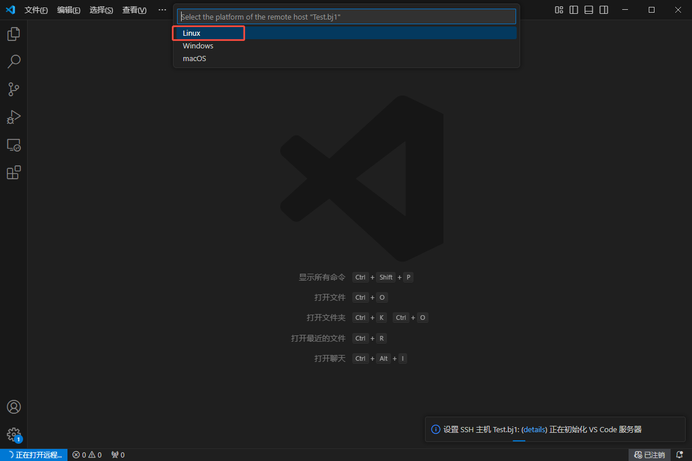
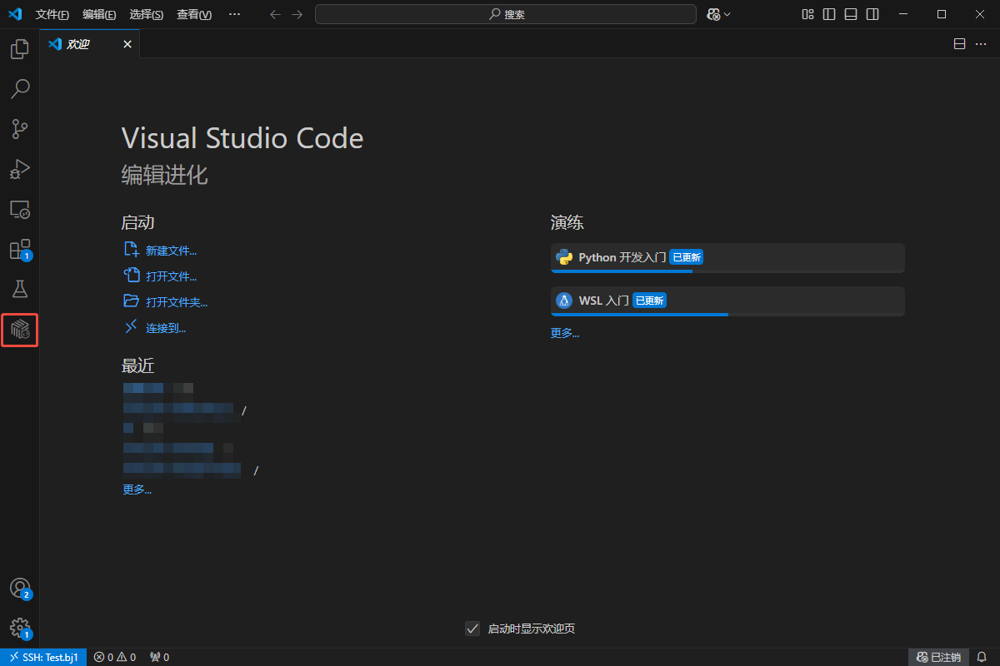
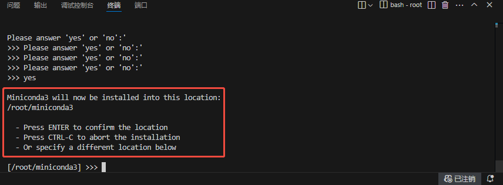
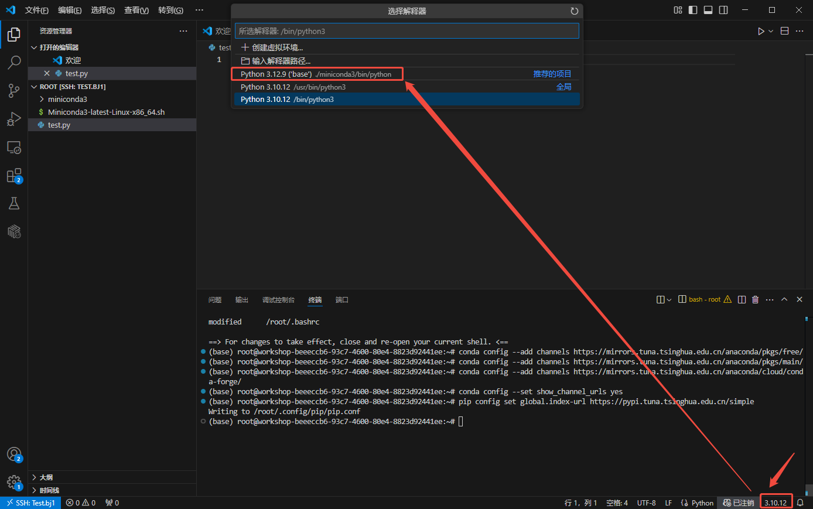
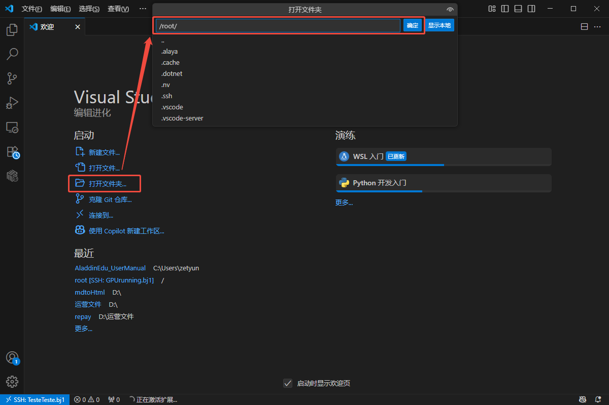
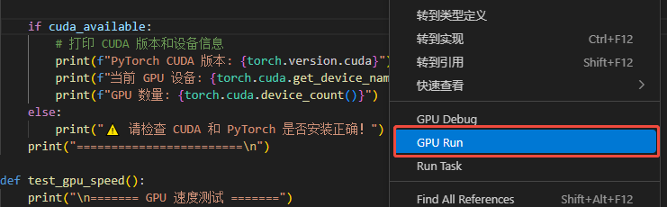

# 快速开始

>AladdinEdu的使用主要分为三步，workshop创建 > 环境配置 > GPU调用，以下内容将围绕此流程展开。

## 插件初始化

_本节预计完成时间：2min_

### 插件安装
以VSCode版本为例

1. 在扩展中搜索Aladdin，点击安装：

   

2. 安装完成后可在活动栏看到Aladdin插件图标，安装成功：

   

### 账号登录
以VSCode版本为例

1. 点击Aladdin插件图标，选择Login Personal Account，弹窗后选择“打开”外部网站（AladdinEdu平台）：

   

2. 在AladdinEdu平台中使用手机号或账号密码登录，首次使用者请先注册：

   

3. 登录成功后点击“点击返回VSCode”，等待返回VSCode（如未自动跳转，请**手动**返回VSCode）。此时VSCode中出现弹窗，选择“打开”此URL，提示登录成功：

   

   

## workshop创建

_本节预计完成时间：3.5min_

>Stop时workshop中的数据（包括环境）将**全部保存**，因此重新Open后无需再次配置和上传数据。总之，workshop在，数据在。但是，自当前算力套餐失效起，若15日内未登录过AladdinEdu平台，存储将会被释放。

workshop为Aladdin插件的编码区，可在本地VSCode中连接远程服务器。

1. 在workshop菜单栏中点击 **+**，新建workshop：

   

2. 填写workshop名称，选择基础镜像与资源（推荐选择“CPU:2 MEM:8G”）：

   

- workshop启动参数介绍

| 参数名称       | 说明                                                                 | 备注                                                                 |
|----------------|----------------------------------------------------------------------|----------------------------------------------------------------------|
| **Environment** | 当前workshop使用的容器镜像                                         | 通常包含预装软件和基础运行环境                                       |
| **Resource**    | 当前workshop启动时分配到的CPU和内存资源                                    | 这些资源与GPU运行时是共享的，<br>GPU资源详情请查看[GPU调用](GPU调用.md) |
| **ENV**        | 当前workshop运行时的环境变量                                         | 可用于配置应用参数、API密钥等敏感信息                                |

- 镜像介绍可查看[配置环境](配置环境.md)

3. 点击提交后会出现插件的状态提示，配置预计在2min左右完成，提示由“Workshop is waiting for creating.”变为“Workshop is created.”：

   

4. 此时会弹出一个新窗口（后文统称为**远端页面**），选择"Linux"，之后远端页面中将自动安装相关插件：

   

5. 等待远端页面中出现Aladdin插件图标，workshop创建完成：

   

>若您3天以上未调用GPU，workshop将会**自动停止**。但请不用担心，workshop停止不会影响其中运行的GPU任务，下次使用重新启动即可~

## 运行Demo

_本节预计完成时间：约1min_
_以下操作均在远端页面中进行。_

<!-- 由于目前保存镜像功能暂未上线，直接将包装在镜像中将无法正常使用。**因此，如需自定义安装python包，均需从零开始配置环境**。
>注：强烈推荐按照本文说明，使用miniconda做环境配置。

1. workshop创建成功后，进入远端页面，选择打开/root目录：

   

2. 新建终端，在终端中安装miniconda，并确认**安装在/root目录**下：

   

   

- Conda配置方法

```bash
# 下载最新版 Miniconda (Linux 64位)
curl -L -O https://mirrors.tuna.tsinghua.edu.cn/anaconda/miniconda/Miniconda3-latest-Linux-x86_64.sh
# 运行安装脚本
bash Miniconda3-latest-Linux-x86_64.sh
# 安装时You can undo this by running `conda init --reverse $SHELL`?
# 此项必须选择Yes,安装完成后重启终端conda命令才能生效~

# 验证安装
conda --version
# 应该显示类似：conda 25.1.1

# 添加清华 conda 源
conda config --add channels https://mirrors.tuna.tsinghua.edu.cn/anaconda/pkgs/free/
conda config --add channels https://mirrors.tuna.tsinghua.edu.cn/anaconda/pkgs/main/
conda config --add channels https://mirrors.tuna.tsinghua.edu.cn/anaconda/cloud/conda-forge/
# 显示通道URL
conda config --set show_channel_urls yes
# 设置 pip 使用清华源
pip config set global.index-url https://pypi.tuna.tsinghua.edu.cn/simple

```
3. 成功安装miniconda后，需配置python解释器——新建一个python文件，点击远端页面右下角的python版本号，切换到conda环境中的python：

或使用`Ctrl+Shift+P`快捷键打开命令窗口，输入"Select Interpreter"，更换python解释器。
>**重要 ❗**：如不切换，调用GPU时将无法复用配置的环境，出现找不到已安装包的报错！

   

4. 远端页面右下角的版本号出现conda环境名，环境切换成功：

   

5. 接着安装torch，推荐安装12.4版以适配GPU：
>配置科学上网后将显著提升下载安装速度，具体步骤参考[学术资源加速](学术资源加速.md)。

```bash
#安装cuda 12.4
pip3 install torch torchvision torchaudio --index-url https://download.pytorch.org/whl/cu124
``` -->

1. 打开/root目录文件夹，新建test.py文件，将测试代码复制到文件中，**在代码区或对文件右击**，选择GPU RUN运行：
   
   
>使用以下代码测试cuda是否安装成功，以及是否与当前环境GPU兼容：

```python
import torch
import time

def test_cuda_availability():
    print("\n======= CUDA 测试 =======")
    # 检查 CUDA 是否可用
    cuda_available = torch.cuda.is_available()
    print(f"PyTorch CUDA 可用: {'✅是' if cuda_available else '❌否'}")

    if cuda_available:
        # 打印 CUDA 版本和设备信息
        print(f"PyTorch CUDA 版本: {torch.version.cuda}")
        print(f"当前 GPU 设备: {torch.cuda.get_device_name(0)}")
        print(f"GPU 数量: {torch.cuda.device_count()}")
    else:
        print("⚠️ 请检查 CUDA 和 PyTorch 是否安装正确！")
    print("========================\n")

def test_gpu_speed():
    print("\n======= GPU 速度测试 =======")
    # 创建一个大型张量
    x = torch.randn(10000, 10000)
    
    # CPU 计算
    start_time = time.time()
    x_cpu = x * x
    cpu_time = time.time() - start_time
    print(f"CPU 计算时间: {cpu_time:.4f} 秒")

    if torch.cuda.is_available():
        # 移动到 GPU 计算
        x_gpu = x.to('cuda')
        start_time = time.time()
        x_gpu = x_gpu * x_gpu
        torch.cuda.synchronize()  # 确保 GPU 计算完成
        gpu_time = time.time() - start_time
        print(f"GPU 计算时间: {gpu_time:.4f} 秒")
        print(f"GPU 比 CPU 快: {cpu_time / gpu_time:.1f} 倍")
    else:
        print("⚠️ GPU 不可用，跳过测试")
    print("==========================\n")

def test_training():
    print("\n======= 简单训练测试 =======")
    # 定义一个极简神经网络
    model = torch.nn.Sequential(
        torch.nn.Linear(10, 100),
        torch.nn.ReLU(),
        torch.nn.Linear(100, 1)
    )
    
    # 如果有 GPU，将模型和数据移到 GPU
    device = 'cuda' if torch.cuda.is_available() else 'cpu'
    model = model.to(device)
    print(f"使用设备: {device.upper()}")

    # 模拟数据
    X = torch.randn(1000, 10).to(device)
    y = torch.randn(1000, 1).to(device)

    # 训练循环
    optimizer = torch.optim.SGD(model.parameters(), lr=0.01)
    start_time = time.time()
    for epoch in range(5):
        optimizer.zero_grad()
        output = model(X)
        loss = torch.nn.functional.mse_loss(output, y)
        loss.backward()
        optimizer.step()
        print(f"Epoch {epoch + 1}, Loss: {loss.item():.4f}")
    
    total_time = time.time() - start_time
    print(f"总训练时间: {total_time:.2f} 秒")
    print("==========================\n")

if __name__ == "__main__":
    test_cuda_availability()
    test_gpu_speed()
    test_training()
```


2. 修改启动选项：环境选择为torch，资源选择为GPU，python解释器按需选择，其余不变。提交运行：

   
> 若选择Save as configuration保存当前参数设置，之后调用GPU时将弹出Quick GPU Run窗口，列出内容为保存的Configuration。您可直接选用以快捷启用GPU Run，或通过+ New Create重新设置参数。
>    

输出内容案例：
```
======= CUDA 测试 =======
 PyTorch CUDA 可用: ✅是
 PyTorch CUDA 版本: 12.4
 当前 GPU 设备: [你选择的显卡]
 GPU 数量: 1
========================

======= GPU 速度测试 =======
 CPU 计算时间: 0.1339 秒
 GPU 计算时间: 0.0078 秒
 GPU 比 CPU 快: 17.3 倍
==========================

======= 简单训练测试 =======
使用设备: CUDA
Epoch 1, Loss: 1.0850
Epoch 2, Loss: 1.0827
Epoch 3, Loss: 1.0805
Epoch 4, Loss: 1.0784
Epoch 5, Loss: 1.0763
总训练时间: 0.17 秒
==========================
 
```

