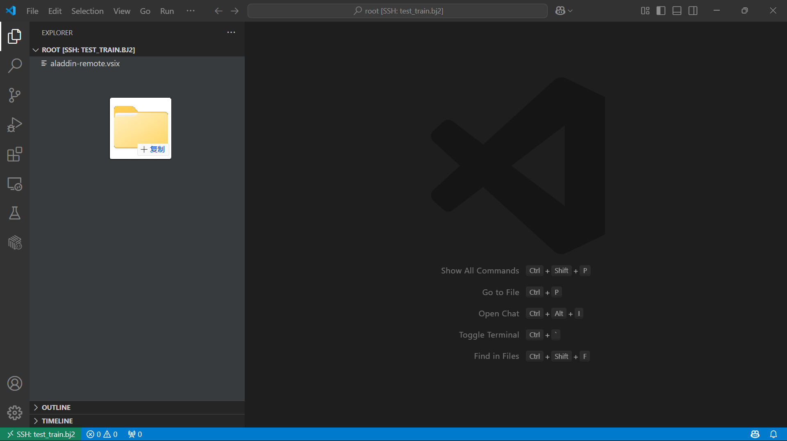
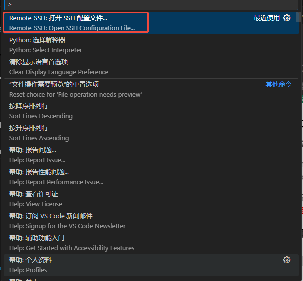

# 数据

## 概要

目前，AladdinEdu平台中的所有存储均为网络盘形式的文件存储，各套餐权益所含存储免费额度与可扩展上限见下表：

| 套餐类型       | 体验版      | 尝鲜版   | 初级版   | 高级版   |
|:----------------:|:---------:|:----------:|:----------:|:----------:|
| 免费文件存储空间 | 30G     | 30G      | 60G      | 100G     |
| 最大可扩展空间  | 不可扩展    | 500G     | 500G     | 2TB      |

>存储计费详见[文件存储计费](./充值与计费.md#文件存储计费)，如需更大的容量请扫码联系客服。

## 存储使用Tips

### 数据保留规则

自当前算力套餐失效、账号不享套餐权益起，若15日内未登录过AladdinEdu平台，存储资源将会**自动回收**。

## 上传下载数据
>文件传输的平均速度为2-3M/s，峰值约为5M/s。如传输速度缓慢，可能是由于带宽负载较大，请稍后再试。

### 小文件传输（M级别文件）

选择工作目录后，可通过直接拖拽至工作区来导入文件。

   

### 大文件传输（G级别文件，强烈推荐）

>传输文件时，推荐调整workshop的资源至可用范围内最大配额，保证传输过程稳定。

1. workshop创建成功后，查看ssh的配置文件：

- 按`Ctrl+Shift+P`快捷键，选择“Remote-SSH: Open SSH Configuration File”

   
   

- 在配置文件中找到workshop名称对应的Host，其中IdentityFile为密钥文件目录

   

2. 配置sftp软件，以FlieZilla Client 为例
<span style="color: red; font-weight: bold">连接、传输时需确保 workshop 处于 running 状态</span>

   

3. 向/root目录下传输文件

   

### scp方式（推荐Mac用户及Linux用户使用）

```bash
#上传命令
scp -r /本地/目录 ${workshop name}:/root/路径

#下载命令
scp -r ${workshop name}:/root/路径 /本地/路径
```

### 公网网盘传输

正在施工中，敬请期待~