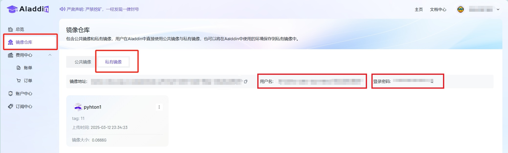
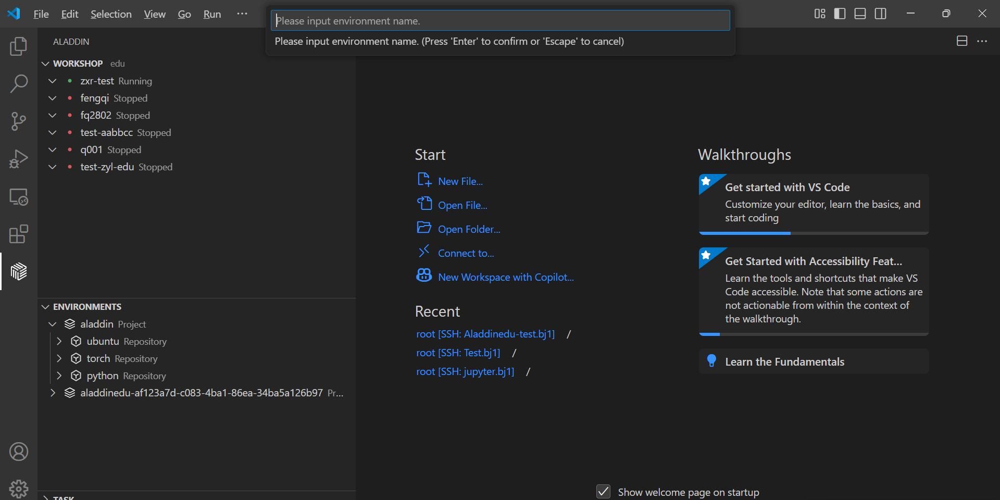

# 配置环境

## 概要

AladdinEdu内置了部分公共镜像，启动workshop时选择公共镜像就会自带相应框架的软件。如果自带的框架版本或Python版本不满足需求，请自行配置其他版本的框架或尝试Python方法。

1. 公共镜像

| 镜像类型 | 版本标签    | 包含内容                                                                 |
|:--------:|:-----------:|:------------------------------------------------------------------------|
| torch    | 2.5.1-cu124 | **核心包:**<br>`torch==2.5.1` `torchvision==0.20.1` `torchaudio==2.5.1` `cuda==12.4`<br>**附加包:**<br>`datasets` `transformers` `scikit-learn` `peft` `tiktoken` `blobfile` `sentencepiece` `protobuf` `deepspeed` |
| torch    | 2.6.0-cu124 | **核心包:**<br>`torch==2.6.0` `torchvision==0.21.0` `torchaudio==2.6.0` `cuda==12.4`<br>**附加包:**<br>同 2.5.1 版本 |
| jupyter-lab | 4.4.2 | **核心包:**<br>`jupyterlab==4.4.2` `torch==2.5.1+cu124` `cuda==12.4` |
|llama-factory | v0.9.3.dev0-cuda12.4-cudnn9-devel |**核心包:** <br>`llamafactory==0.9.3` `peft==0.15.1` `trl==0.9.6`<br>`accelerate==1.6.0` `transformers==4.51.3`<br>`torch==2.7.0` `cuda==12.6` | 
|llama-factory | v0.9.3.dev0-cuda12.1-cudnn9-devel |**核心包:** <br>`llamafactory==0.9.3` `peft==0.15.1` `trl==0.9.6`<br>`accelerate==1.6.0` `transformers==4.51.3`<br>`torch==2.7.0` `cuda==12.1` | 
|python | 3.10/3.11/3.12/3.13 | 纯净Python环境 |
| ubuntu   | 22.04       | 纯净 Ubuntu 22.04 系统                                                  |
> 注：jupyter-lab和llama-factory均已配conda。如您选用jupyter-lab和llam-factory作为workshop的基础镜像，后续配置环境时无需再手动安装conda。

2. 安装其他版本的Python： 推荐使用Miniconda创建其他版本的Python虚拟环境

```bash
# 构建一个虚拟环境名为：myenv，Python版本为3.7
conda create -n myenv python=3.7    

# 更新bashrc中的环境变量
conda init bash && source /root/.bashrc
# 切换到创建的虚拟环境：my-env
conda activate myenv

# 验证
python --version
```

3. 安装PyTorch： [参考链接](https://pytorch.org/get-started/previous-versions/)

>❗ 注意：
1️⃣ 通过Torch官方的conda安装命令，在国内安装的conda一般为非cuda版本，而是cpu版本（有bug），因此推荐用pip安装。并且，如果使用torch官方的pip命令，去掉-f/--index-url参数，这样可以走国内的pip源，速度更快；
2️⃣ 平台中目前所提供显卡支持的最低cuda版本为11.8，过低版本可能会导致计算性能损失。

4. 安装TensorFlow： [参考链接](https://www.tensorflow.org/install/pip?hl=zh-cn)

- **推荐的使用姿势**
  （1）如果平台内置的公共镜像中有您需要的Torch、TensorFlow等框架的相应版本，首选公共镜像。
  （2）如果以上条件都不满足，推荐使用Ubuntu系统，并自行安装miniconda进行环境配置。

## 私有镜像
AladdinEdu支持保存私有镜像，分为两种方式：本地上传私有镜像、保存workshop环境镜像。私有镜像可在控制台的私有镜像仓库、本地VSCode的ENVIRONMENTS中查看。

### 上传私有镜像
1. 打开电脑终端，逐条输入以下命令（以python3为例），推送成功后即成功在私有镜像仓库中新增镜像：
```python
# 登录
docker login registry.hd-01.alayanew.com:8443
# 拉取镜像
docker pull m.daocloud.io/docker.io/library/python:3
# 镜像tag重命名
docker tag m.daocloud.io/docker.io/library/python registry.hd-01.alayanew.com:8443/aladdinedu-e3fadb18-a994-470f-9a59-dde816718791/python:3
# 推送镜像
docker push registry.hd-01.alayanew.com:8443/aladdinedu-e3fadb18-a994-470f-9a59-dde816718791/python:3
```

> 用户名、密码在控制台的私有镜像仓库页查看

   
2. 在VSCode中登录Aladdin，并在Registry中填入私有镜像仓库的用户名、密码，登录私有镜像仓库：
   
3. 此时，ENVIRONMENTS中可查看私有镜像仓库，其中列出了上传的私有镜像，在workshop、GPU配置页中可直接选择使用。
   

### 保存workshop环境

如需将在workshop中使用的环境保存到私有镜像中，可按如下步骤操作。<span style="color: red; font-weight: bold">需注意，以下步骤要求 workshop 为 running 状态。<Span/>

1. **启动workshop**， 右键选择“Save Env”：
   
2. 选择私有镜像仓库，回车：
   
3. 输入要保存的workshop环境名，回车：
   
4. 输入tag，回车，等待保存：
   
5. 选择yes，更新当前workshop镜像：
   
  > 如果选择no，保存的workshop环境不会作用于当前workshop。
6. 更新成功后，私有镜像仓库中即会存有该环境，此时在workshop、GPU配置页中可选择使用该环境。
